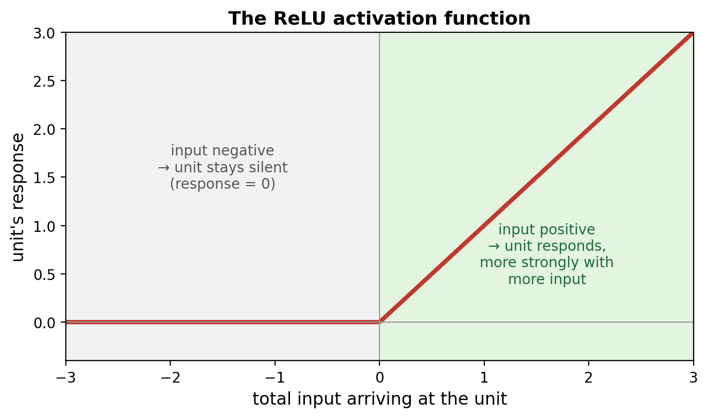
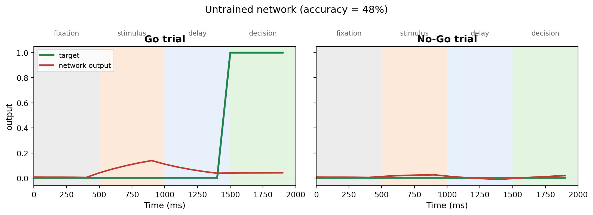

We now have a task waiting for a network ([Task Design](TaskDesign.qmd)), and we know what an RNN is made of: an **input** that brings information in, a **hidden layer** of recurrently connected units that compute through time, and an **output** that reads out a decision.

Time to actually build one!

## A quick word on PyTorch

To build neural networks in Python, we'll use **PyTorch**: the most popular library for the job. It does two things we care about. First, it stores our numbers in **tensors**, which are just like the NumPy arrays we've been using, but PyTorch's own version. Second (and this is the magic we'll use in the *next* tutorial), it can automatically work out how to improve the network during training.

For now, we only need one of its building blocks: `nn.Linear`. Despite the fancy name, an `nn.Linear` is simply **a set of weights connecting one group of numbers to another**: a weight matrix. You create it by saying how many numbers go *in* and how many come *out*:

``` python
import torch
import torch.nn as nn

example = nn.Linear(3, 100)   # takes 3 numbers in, produces 100 numbers out
```

And you use it by *calling* it like a function. That's all we need to know to build our three sets of connections.

## The three sets of weights

Remember from the [first RNN tutorial](WhatIsAnRNN.qmd) that an RNN has exactly three sets of weights. Let's create each one as an `nn.Linear`, choosing the sizes to match our task.

Our task has **3 input channels** (fixation, Go, No-Go), we'll use **100 hidden units** (the same as our 100-region brains!), and we need **1 output** (respond or not). So:

``` python
n_input, n_hidden, n_output = 3, 100, 1

W_in  = nn.Linear(n_input,  n_hidden)   # input  -> hidden  (3  -> 100)
W_rec = nn.Linear(n_hidden, n_hidden)   # hidden -> hidden  (100 -> 100)
W_out = nn.Linear(n_hidden, n_output)   # hidden -> output  (100 -> 1)
```

Look at the middle one: `W_rec` connects the 100 hidden units to themselves, so its weights form a **100 × 100 matrix**. That is our connectivity matrix, the same kind of object we studied all through the brain-network sections, now living inside a neural network!

## One step of activity

Now for the heart of the network: how the units' activity is updated at each moment in time.

The activity of the hidden units is just a list of 100 numbers, which we'll call `h` (for "hidden"). At the very start of a trial, nothing is happening, so we set it all to zero:

``` python
h = torch.zeros(n_hidden)   # 100 units, all silent to begin with
```

At each timestep, every unit first gathers all the signals **arriving** at it. There are two sources:

- the **input** from outside, passed through the input weights: `W_in(x_t)`,
- the signals from **the other units**, passed through the recurrent weights: `W_rec(h)`.

We add these up to get the **total input** arriving at each unit:

``` python
total_input = W_in(x_t) + W_rec(h)
```

### From total input to response: the activation function

Here's a distinction that's easy to miss but really matters: the total input is just *what arrives* at a unit; it is **not** the same as how active the unit actually becomes.

Think of a real neuron. It is constantly bombarded by signals from thousands of others, but it doesn't simply pass on their sum. It adds everything up and only **fires** if the signal is strong enough.

So how do we decide whether one of *our* units responds, and how strongly? With an **activation function**: a rule that takes the total input arriving at a unit and turns it into the unit's actual response.

The one we'll use is called the **ReLU** (short for *rectified linear unit*), and it captures that neuron-like behaviour with a beautifully simple rule:

- if the total input is **negative**, the unit stays **silent** (its response is 0),
- if the total input is **positive**, the unit responds in proportion (the more input, the stronger the response).

{width="75%" fig-align="center"}

In code, the ReLU is a single function call. We apply it to the total input to get each unit's response, which we'll call `drive`:

``` python
drive = torch.relu(total_input)
```

::: callout-note
## Is this what real neurons do?

Pretty much! A neuron's **input-output curve** (how its firing rate depends on the input it receives) really does stay near zero until the input is strong enough, and then climbs as the input grows, just like our ReLU. Measured in awake animals, the curve is a little *softer* and more rounded than ReLU's sharp corner, and it eventually *flattens off* (saturates) at very high inputs, a shape known as the **Ricciardi function**. But across the range where neurons normally operate, that curve is close to a straight line, so the humble ReLU turns out to be a good, simple stand-in for what real cortical neurons do ([LaFosse et al., 2024](https://doi.org/10.1073/pnas.2318837121)).
:::

### Keeping it stable: the leak

We're almost there. The obvious next move is to just say that the hidden units `h = drive`: make each unit's new activity equal to the response we computed. But that would cause a problem.

Remember what `drive` is: the signal pouring in from *up to 100 other units*, plus the external input, all summed together. That sum can swing wildly from one timestep to the next. If we overwrote hidden units `h` with `drive` at every step, each unit would throw away whatever it was doing and be **completely overwhelmed by the flood of incoming signal at every single moment**... The whole network would be jittery and unstable.

Real neurons don't behave like that, and neither should ours. We want a bit of **stability**, some inertia. So instead of *overwriting* the hidden units `h`, we let each unit keep most of its current value and only edge a little towards the new drive:

``` python
alpha = 0.2
h = (1 - alpha) * h + alpha * drive
```

This is the **leaky** update (that's the *Leaky* in Leaky RNN), and there's a homely way to picture it: imagine each unit as a **leaky bucket**. Because the bucket leaks a little at every step, old activity fades away *gradually* rather than disappearing all at once. The activity that remains is `(1 - alpha) * h`, and `alpha * drive` is the new activity coming in.

This leak buys us two things at once: the **stability** we were after, and, as a lovely side effect, a built-in **memory**, because by holding onto its past each unit carries information forward in time, exactly as we promised back in [Computing through Time](#0).

::: callout-note
## What is `alpha`?

`alpha` is the **leak rate**: how much new activity is mixed in at each step. With `alpha = 0.2`, a unit keeps 80% of its current activity and adds 20% of the new activity. So a small `alpha` means lots of inertia and a long memory, while a large `alpha` means the unit barely holds anything from one moment to the next. Instead of specifying `alpha` directly, we often specify the neuron's *membrane time constant* $\tau$: how long activity takes to fade. We can then compute `alpha`as $\alpha = dt / \tau$
:::

## Processing a whole trial

A single step updates all the hidden units `h` once. To run a whole trial, we simply **loop over all the timesteps**, updating `h` at each one:

``` python
h = torch.zeros(n_hidden)
for t in range(T):    # T timesteps in the trial
    drive = torch.relu(W_in(x[t]) + W_rec(h))
    h = (1 - alpha) * h + alpha * drive
```

This runs! At every timestep the units take in their input, respond, and update their activity, and that activity carries forward to the next step. The network is happily *computing* away...

But hold on, do you notice something missing? All of this is happening **inside** the network, among the hidden units. Nothing ever comes back *out*! Our network is thinking hard, but it never actually gives an answer; we have no way to tell whether, on a given trial, it decided to "respond" or to "hold back".

That's the job of the third set of weights we created earlier: the **output weights** `W_out`. At each timestep, `W_out(h)` takes the activity of all 100 hidden units and combines them into our single output number: the network's response at that moment. It's the mirror image of `W_in`: where `W_in` took our 3 inputs and spread them across 100 units, `W_out` collapses those 100 units back down to 1 number.

So we read out the response at each step and collect them as we go:

``` python
h = torch.zeros(n_hidden)
outputs = []
for t in range(T):    # T timesteps in the trial
    drive = torch.relu(W_in(x[t]) + W_rec(h))
    h = (1 - alpha) * h + alpha * drive
    outputs.append(W_out(h))   # read out the network's response this step
```

After the loop, `outputs` holds the network's response at every timestep: exactly the thing we'll compare against our target `y`.

## Putting it all together

We've now built every piece: the three sets of weights, the leaky update, and the loop over time. The last step is to bundle them into one tidy, reusable network.

In Python, a **class** is a way to bundle some data together with the functions that act on it. PyTorch asks us to write every network as a class built on top of its own **`nn.Module`**, which hands our network a lot of useful machinery for free, including the automatic training tools we'll use in the next tutorial.

We only have to fill in two parts, and we've already worked out the contents of both:

- **`__init__`** is the *setup*, run once when we first create the network. This is where we create our three sets of weights (and store `alpha`). We save each one on `self` (the network itself) so that the other part can reach them later.
- **`forward`** is the *computation*, run every time we feed the network an input `x`. This is exactly our loop over timesteps from the previous section.

``` python
import torch
import torch.nn as nn

class LeakyRNN(nn.Module):
    def __init__(self, n_input, n_hidden, n_output, alpha=0.2):
        super().__init__()
        self.alpha = alpha
        self.n_hidden = n_hidden
        self.W_in  = nn.Linear(n_input,  n_hidden)
        self.W_rec = nn.Linear(n_hidden, n_hidden)
        self.W_out = nn.Linear(n_hidden, n_output)

    def forward(self, x):
        T, batch, _ = x.shape
        h = torch.zeros(batch, self.n_hidden)     # start all units at zero
        outputs = []
        for t in range(T):
            drive = torch.relu(self.W_in(x[t]) + self.W_rec(h))
            h = (1 - self.alpha) * h + self.alpha * drive
            outputs.append(self.W_out(h))
        return torch.stack(outputs)               # (T, batch, 1)
```

And that's it: a complete recurrent neural network, built from scratch!

A few of these lines are new, so let's walk through them one at a time.

- **`super().__init__()`** lets `nn.Module` set up its behind-the-scenes machinery. You don't need to follow exactly what it does; just always include it as the first line of `__init__`.

- **Running a whole batch at once.** Back in [Task Design](TaskDesign.qmd) we generated our trials in batches, with shape `(time, trials, channels)`. The first line of `forward`, `T, batch, _ = x.shape`, simply reads those numbers off the input: how many timesteps `T` and how many trials `batch` we were handed (the `_` is the channel count, which we don't need here).

- **`torch.stack(outputs)`.** At each timestep we appended one response, `W_out(h)`, to the list `outputs`. After the loop, that list holds `T` separate little tensors: one timestep's response after another. `torch.stack` piles them up into a *single* tensor, stacking along a new first dimension for time, giving the shape `(T, batch, 1)`. That's the same time-first layout as our target `y`, so the network's output and the target line up neatly, ready to compare.

## Taking it for a spin (before any training)

Let's create a network and immediately try it on the task. Crucially, we have **not trained it yet**, so all its weights are still random. We don't expect it to be any good... but let's see exactly how bad it is!

``` python
model = LeakyRNN(n_input=3, n_hidden=100, n_output=1)

# generate a big batch of trials and run them through the network
x, y, labels = generate_batch(batch_size=500)
x = torch.tensor(x, dtype=torch.float32)
outputs = model(x)                                  # (T, batch, 1)
```

To score it, we look at the network's output during the **decision period** (the last 5 timesteps). If its average output there is above 0.5, we count that as "responded"; otherwise "held back". Then we check how often that matches the correct answer:

``` python
response  = outputs[15:, :, 0].mean(0)              # mean output in the decision period
predicted = (response > 0.5).int()                  # responded (1) or held (0)?
labels    = torch.tensor(labels)
accuracy  = (predicted == labels).float().mean()
print(accuracy)       
```

Around **50%**: pure chance! (Half the trials are No-Go, and our untrained network basically never responds, so it "gets" all the No-Go trials by accident and misses all the Go trials.) Here's what its output actually looks like on an example Go and No-Go trial:

{width="100%" fig-align="center"}

On the Go trial, the target (green) jumps up in the decision period, but the network (red) barely twitches: it completely fails to respond. The architecture is all there, but the **weights are meaningless** because the network hasn't learned the task yet.

## What's next

We've built a real recurrent network and confirmed that, untrained, it's no better than guessing. So how does it go from random weights to weights that actually solve the task?

That is **learning**, and it's the subject of the next tutorial. We'll meet gradient descent, write the training loop, and watch that 50% climb. See you there! 🚀