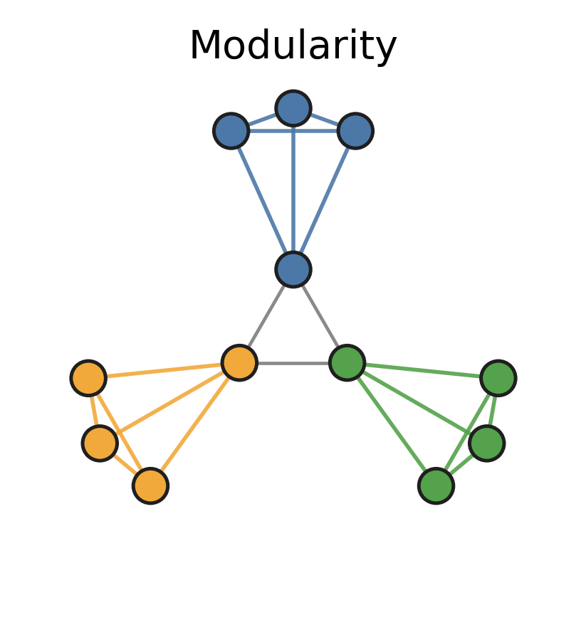
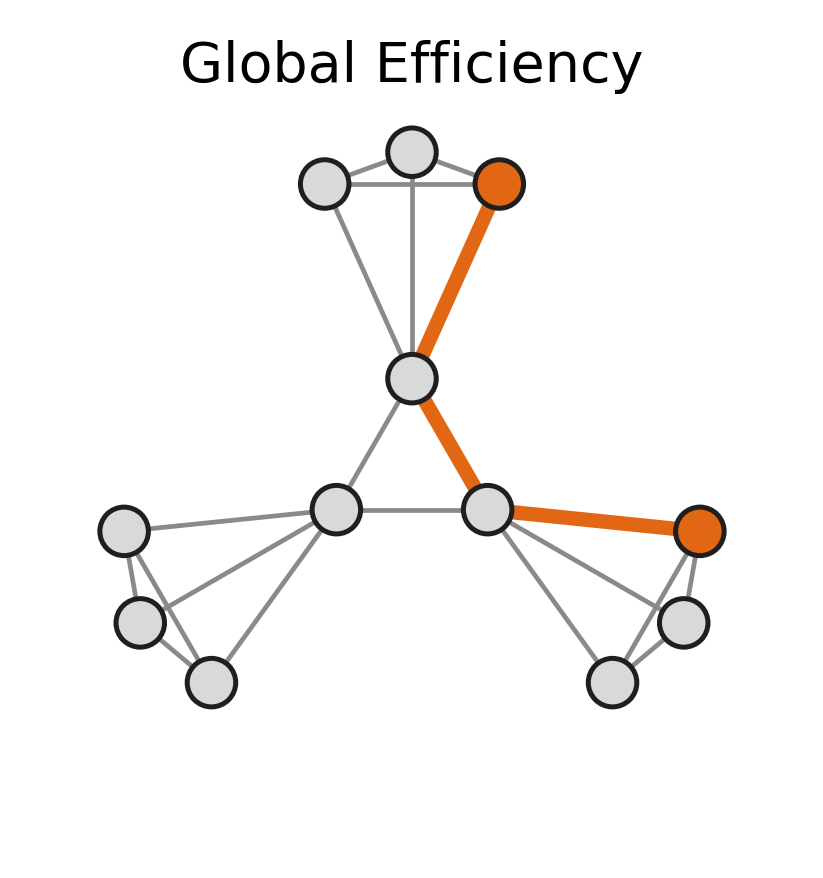
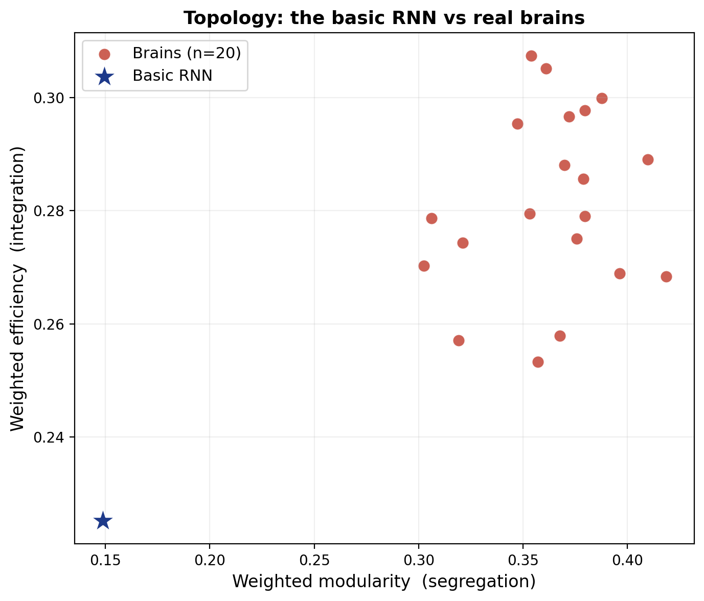

In the [previous tutorial](LookingInsideTheRNN.qmd) we cleaned up the RNN's `W_rec`, until, in *format*, it was exactly like the brain connectivity matrix. We could finally lay the two side by side.

But eyeballing only gets us so far. Now for the real test: do they have the same **topology**? In other words, is our RNN actually wired like a brain, or does it just happen to be the same shape of grid?

## Two summary measures

In the [Topology tutorial](Topology.qmd) we measured several properties of brain networks. Here we'll introduce **two** more summary measures that, together, capture the brain's signature organisation.

### Modularity

The first measure is **modularity**. It asks whether the network breaks up into **modules**: groups of nodes that are densely wired *to each other* but only loosely connected to the rest.

{width="50%" fig-align="center"}

In the little network above there are three clear modules (blue, orange, green). Inside each one, every node talks to its neighbours, while only a single thin bridge links one module to the next. A network like this has **high modularity**. Brains are modular in exactly this way: visual areas wire mostly to other visual areas, motor areas to motor areas, and so on. So modularity measures **segregation**: how much a network keeps its specialised parts to themselves.

### Global efficiency

Global efficiency asks almost the opposite question: starting from any node, how *few* steps does it take to reach any other node?

{width="50%" fig-align="center"}

Here we've highlighted the shortest route between two nodes that sit in *different* modules, and it's only a couple of hops. When *every* pair of nodes can be reached in just a few steps, the network has **high global efficiency**. Brains are remarkably efficient: even though they're carved into modules, a signal can still get from almost anywhere to anywhere in a handful of steps. So efficiency measures **integration**: how easily the whole network can act as one.

The cool thing is that brains manage to be **both** highly modular **and** highly efficient *at the same time*!! That combination is called a **small-world** network, and it's one of the most reliable signatures of brain organisation. So if our RNN is truly brain-like, it should score high on *both* measures, landing right next to the brains.

## (Almost) ready to compare

Amazing, it looks like everything is ready to compare our networks! ...Or maybe not!!! If you did our [Preprocessing tutorial](Preprocessing.qmd), you'll remember there are **two more things** we have to take care of before any two networks can be compared fairly.

### 1. The same density

We saw in [Preprocessing](Preprocessing.qmd) that density and topology are tightly linked (a denser network is automatically more efficient and less modular), so comparing networks at *different* densities would tell us nothing. The brains were already trimmed to a common density back then; we now do the same to the RNN, keeping only its **strongest** connections until it matches.

Putting that together with the clean-up from the [last tutorial](LookingInsideTheRNN.qmd) (positive, symmetric, no diagonal, rescaled to 0–1), our full preprocessing is just:

``` python
import numpy as np
from netneurotools.networks import threshold_network

def preprocess(W, density=None):
    W = np.abs(W)                 # strengths, not signs   (last tutorial)
    W = (W + W.T) / 2             # symmetrise             (last tutorial)
    np.fill_diagonal(W, 0)        # no self-connections    (last tutorial)
    if density is not None:       # NEW: keep the strongest connections (exactly as in Preprocessing)
        keep = threshold_network(W, retain=density * 100)  # 0/1 mask of which connections to keep
        W = keep * W                                       # apply the mask, keeping the weights
    return W / W.max()            # rescale to 0–1 so the two scales match
```

### 2. Fully connected

The second requirement is that the network be **fully connected**: you should be able to travel from any node to any other. This matters because several topology measures break down when part of the network is cut off from the rest. The brains all passed this check back in the Preprocessing tutorial. Let's check the RNN, once it's been trimmed to the brains' density:

``` python
import networkx as nx

rnn = preprocess(W_rec, density=0.18)
print(nx.is_connected(nx.from_numpy_array(rnn)))   # -> True
```

It's fully connected too. So both networks are now on exactly the same footing, and we're finally ready to compare them!

::: callout-note
## What if a network *had* come out disconnected?

We just made a fuss about connectivity, so you might worry: what happens to our two measures if a trimmed network ends up in pieces, with some nodes cut off from the rest? Good news: **modularity** and **global efficiency** are exactly the two measures that *don't* mind.

- **Modularity** never looks at paths at all. It only asks whether nodes cluster into densely-wired groups, so a network in two disconnected pieces is perfectly fine, it's just a very modular network.
- **Global efficiency** is built to handle it by design. For a pair of nodes you *can't* reach, the distance is infinite, and efficiency counts that pair as $1/\infty = 0$. Unreachable pairs simply contribute nothing to the average, no crashes, no infinities.

This is actually *why* these two are such popular choices. Contrast them with a measure like the **characteristic path length** (the average shortest path): the moment one pair of nodes is unreachable, that average shoots off to infinity and the whole number becomes meaningless. Modularity and efficiency stay well-defined no matter what, which is why we lean on them here.
:::

## Measuring weighted topology

Now the two metrics. **Modularity** is a one-liner with `networkx` (it finds communities and scores how modular they are, using the weights):

``` python
import networkx as nx

def weighted_modularity(W):
    G = nx.from_numpy_array(W)
    communities = nx.community.louvain_communities(G, weight="weight", seed=42)
    return nx.community.modularity(G, communities, weight="weight")
```

For **efficiency** we turn each connection *strength* into a *distance* (a strong connection is a **short** hop), find the shortest weighted path between every pair of nodes, and average `1 / distance`:

``` python
def weighted_efficiency(W):
    G = nx.from_numpy_array(W)
    for _, _, d in G.edges(data=True):
        d["dist"] = 1 / d["weight"]          # strong connection -> short distance
    n, total = G.number_of_nodes(), 0.0
    for src, lengths in nx.all_pairs_dijkstra_path_length(G, weight="dist"):
        for tgt, dist in lengths.items():
            if src != tgt:
                total += 1 / dist            # efficiency of this pair
    return total / (n * (n - 1))
```

::: callout-note
## Why write this by hand?

For modularity, `networkx` has us covered. For weighted efficiency it doesn't: `nx.global_efficiency` exists, but it quietly **ignores the weights** and treats every connection as a single equal hop, which isn't what we want. So we spell out the weighted version ourselves. If you'd rather not hand-roll it, the standard tool in the field is [`bctpy`](https://github.com/aestrivex/bctpy)'s `efficiency_wei`, a one-liner that does exactly the same thing.
:::

We run both on the trained RNN and on each of our 20 brains:

``` python
import numpy as np

brains = np.load("brain_networks_20_preprocessed.npy")   # the 20 brains, already at a common density

# the RNN: `rnn` is the preprocessed W_rec from above
rnn_mod = weighted_modularity(rnn)
rnn_eff = weighted_efficiency(rnn)

# each brain is already at the common density, so preprocess() just cleans + rescales it
brain_mod = [weighted_modularity(preprocess(b)) for b in brains]
brain_eff = [weighted_efficiency(preprocess(b)) for b in brains]
```

And here are the results:

{width="80%" fig-align="center"}

The 20 brains are all together in the **top-right**: highly modular *and* highly efficient, exactly as small-world networks should be. Our basic RNN (the blue star) sits far away in the **bottom-left**, with **much lower modularity** **and lower efficiency** than *any* of the brains.

So the answer to our original question (Is our RNN brain-like?) is a clear **no**. A network trained to do one simple task does **not** spontaneously wire itself like a brain. It solved the job perfectly well, but with a flat, weakly-structured connectivity that looks nothing like the brain's segregated-yet-integrated organisation.

That's not a disappointment though, it's where things get interesting! In the tutorial we will release next, we will start making our RNN a little more brain-like! 🚀