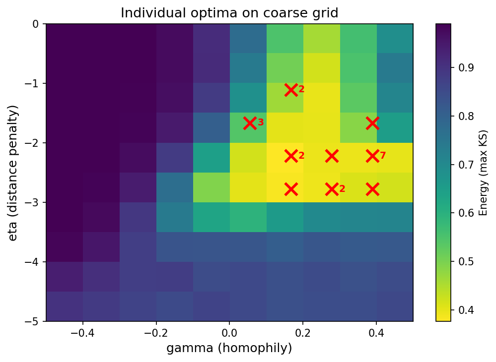
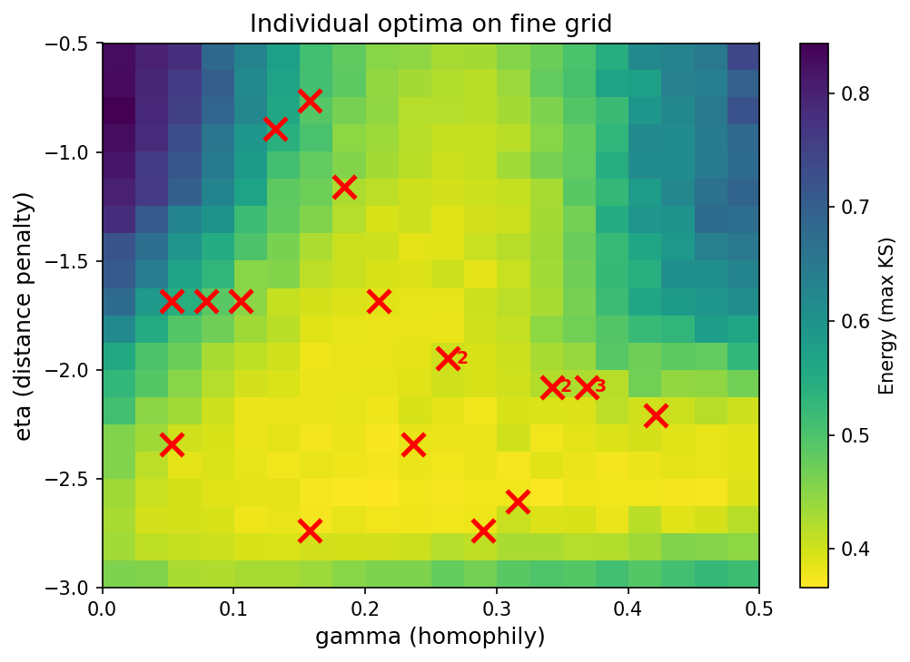
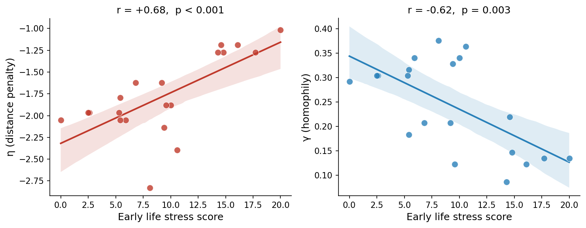

In the last tutorial we found the combination of η and γ that best describes the *average* brain across all 20 participants. But that's just the beginning of the story!

Think about it: we've been summarising 20 different brains with a single pair of numbers. In reality, each brain follows its own wiring rules. Some people might have a stronger distance penalty, meaning their brains are built more locally. Others might show stronger homophily, meaning their brains have tighter clusters. And if those individual differences in wiring rules are meaningful, they might relate to something biologically important.

If you remember from the [Research Question](ResearchQuestion.qmd) tutorial, the central prediction of the **Adaptive Stochasticity Hypothesis** is that brains shaped by adversity develop in a more stochastic, less constrained way. So our research question is: **do people who experienced more early life stress end up having brains wired differently?**

Now we can finally tackle it head on!

## Our 20 brains

Let's start by reminding ourselves of what we are working with. Here are the 20 brain networks we have been working with throughout these tutorials:

{width="85%" fig-align="center"}

Each panel shows a different individual's connectivity matrix. They all look similar at a glance, but the differences between them are exactly what we want to capture. The key question is: are those differences related to early life stress?

## From group to individual

In the last tutorial, we averaged energy across all 20 brains to find the single best-fitting (η, γ). Now we want to be more specific: for *each brain separately*, we pick the parameter configuration that gave that brain the lowest energy.

We don't need to run a new sweep for this! All the info is already in the experiments from last time. Let's load them:

``` python
import pickle
import numpy as np
import torch
import pandas as pd
import matplotlib.pyplot as plt
from collections import Counter

with open("experiments.pkl", "rb") as f:
    group_experiments = pickle.load(f)
```

For each brain, we find the combination of parameters that leads to the lowest (the best) energy by averaging over simulations (there is some extra code to rebuild the group-level landscape so we can use it for background colors in the plot):

``` python
# Per-brain coarse optima
per_brain_energy  = torch.stack(
    [exp['energy_tensor'].mean(dim=0) for exp in group_experiments]
)  # [n_configs, n_brains]
best_config_per_brain = per_brain_energy.argmin(dim=0)

ind_eta_c   = [group_experiments[int(idx)]['eta']   for idx in best_config_per_brain]
ind_gamma_c = [group_experiments[int(idx)]['gamma'] for idx in best_config_per_brain]

# Rebuild landscape and group optimum for plotting
mean_energies_group = [float(exp['energy_tensor'].mean()) for exp in group_experiments]
rows_group = [{"eta": exp['eta'], "gamma": exp['gamma'], "energy": e}
              for exp, e in zip(group_experiments, mean_energies_group)]
landscape   = pd.DataFrame(rows_group).pivot(index="eta", columns="gamma", values="energy")
best_idx    = int(np.argmin(mean_energies_group))
group_eta   = group_experiments[best_idx]['eta']
group_gamma = group_experiments[best_idx]['gamma']

counts = Counter(zip(ind_eta_c, ind_gamma_c))

fig, ax = plt.subplots(figsize=(7, 5))
im = ax.imshow(
    landscape.values,
    origin="lower", aspect="auto", cmap="viridis_r",
    extent=[
        landscape.columns.min(), landscape.columns.max(),
        landscape.index.min(),   landscape.index.max(),
    ],
)
for (eta_val, gamma_val), n in counts.items():
    ax.scatter(gamma_val, eta_val, marker="x", s=140, color="white",
               linewidths=2.5, zorder=5)
    if n > 1:
        ax.text(gamma_val + 0.02, eta_val + 0.1, str(n),
                color="white", fontsize=9, fontweight="bold", zorder=6)
ax.scatter(group_gamma, group_eta, s=150, color="red", zorder=7, label="Group optimum")
plt.colorbar(im, ax=ax, label="Energy (max KS)")
ax.set_xlabel("gamma (homophily)", fontsize=12)
ax.set_ylabel("eta (distance penalty)", fontsize=12)
ax.set_title("Individual optima on coarse grid", fontsize=13)
ax.legend(fontsize=10)
plt.tight_layout()
plt.savefig("../images/GenerativeModels/individual_landscape_coarse.png", dpi=150)
plt.show()
```

{width="80%" fig-align="center"}

Do you see the problem? The red numbers next to the Xs show how many participants are stacked at the exact same point! With a coarse 10×10 grid, many individuals end up sharing the same (η, γ) even though their true optima may be slightly different. **We are losing precision.**

## A finer sweep

To fix this, we run a second, more targeted sweep. Looking at the coarse landscape, the interesting action is clearly happening in a narrower region: roughly η between −3 and −0.5, and γ between 0 and 0.5. So that's exactly where we sweep:

::: callout-important
## Choose the sweep range carefully!

There is no automatic rule for picking the fine-sweep range. We chose η ∈ \[−3, −0.5\] and γ ∈ \[0, 0.5\] by eye, based on where the coarse landscape placed most individual optima. For your own dataset, you will need to do the same inspection.

One thing that is **critical**: after extracting the per-brain optima, make sure no participant ends up with their best point right on the *border* of the parameter space. If someone's best (η, γ) is at the minimum or maximum value you tested, their true optimum might be *beyond* that boundary and you are artificially clamping them. When this happens, widen the range in that direction and re-run.
:::

For this we need to load the brain networks, distance matrix (and, since we'll need them later, the stress scores too):

``` python
import numpy as np
import torch

brains = np.load("brain_networks_20_preprocessed.npy")
num_brains, num_nodes, _ = brains.shape
binary_brains = (brains > 0).astype(float)
binary_brains_tensor = torch.tensor(binary_brains, dtype=torch.float32)

dist_np = np.load("distance_matrix.npy")
distance_matrix = torch.tensor(dist_np, dtype=torch.float32)

stress_scores = np.load("stress_scores.npy")
num_connections = int(binary_brains_tensor[0].sum().item() / 2)
```

``` python
from gnm import fitting, generative_rules, evaluation

criteria = [
    evaluation.DegreeKS(),
    evaluation.BetweennessKS(),
    evaluation.ClusteringKS(),
    evaluation.EdgeLengthKS(distance_matrix),
]
energy = evaluation.MaxCriteria(criteria)

n_eta   = 30
n_gamma = 30
n_sims  = 30

eta_values   = torch.linspace(-3.0, -0.5, n_eta)
gamma_values = torch.linspace( 0.0,  0.5, n_gamma)

binary_sweep_parameters = fitting.BinarySweepParameters(
    eta    = eta_values,
    gamma  = gamma_values,
    distance_relationship_type         = ["powerlaw"],
    preferential_relationship_type     = ["powerlaw"],
    generative_rule  = [generative_rules.MatchingIndex()],
    num_iterations   = [num_connections],
)
sweep_config = fitting.SweepConfig(
    binary_sweep_parameters = binary_sweep_parameters,
    num_simulations         = n_sims,
    distance_matrix         = [distance_matrix],
)
```

We increased `n_eta` and `n_gamma` to 30 each (instead of 10), and we also increased `n_sims` to 30. More simulations mean more stable estimates for each individual, which is important when we're trying to detect subtle differences between people.

``` python
import time

start = time.perf_counter()

raw_fine = fitting.perform_sweep(
    sweep_config         = sweep_config,
    binary_evaluations   = [energy],
    real_binary_matrices = binary_brains_tensor,
    save_model           = False,
    save_run_history     = False,
)

elapsed = time.perf_counter() - start
print(f"Sweep complete in {elapsed:.1f} s")

# Convert to plain dicts (same format as the group experiments)
energy_key = str(energy)
experiments_fine = [
    {
        "eta":           float(exp.run_config.binary_parameters.eta),
        "gamma":         float(exp.run_config.binary_parameters.gamma),
        "energy_tensor": exp.evaluation_results.binary_evaluations[energy_key],
    }
    for exp in raw_fine
]
```

::: callout-note
## How long will this take?

30 × 30 = 900 parameter combinations × 30 simulations = 27 000 model runs. On a normal laptop, you may want to run it before leaving work and come back for the results the morning after!

So for now, download the pre-computed results below!

<a href="../resources/GenerativeModels/individual_experiments.pkl" download class="btn btn-primary btn-sm" style="margin-top:6px;">⬇ Download individual_experiments.pkl</a>

``` python
import pickle

with open("individual_experiments.pkl", "rb") as f:
    experiments_fine = pickle.load(f)
```
:::

## Checking the fine-grid optima

Let's extract the individual optima from the fine sweep and verify that participants are now spread across distinct grid points:

``` python
# Per-brain fine optima: same logic as before
per_brain_fine   = torch.stack(
    [exp['energy_tensor'].mean(dim=0) for exp in experiments_fine]
)  # [n_configs, n_brains]
best_config_fine = per_brain_fine.argmin(dim=0)  # [n_brains]

ind_eta_f   = [experiments_fine[int(idx)]['eta']   for idx in best_config_fine]
ind_gamma_f = [experiments_fine[int(idx)]['gamma'] for idx in best_config_fine]

counts_fine = Counter(zip(ind_eta_f, ind_gamma_f))
print(f"Unique fine optima: {len(counts_fine)} out of {num_brains}")
```

``` python
mean_energies_fine = [float(exp['energy_tensor'].mean()) for exp in experiments_fine]
rows_fine   = [
    {"eta": exp['eta'], "gamma": exp['gamma'], "energy": e}
    for exp, e in zip(experiments_fine, mean_energies_fine)
]
df_fine        = pd.DataFrame(rows_fine)
landscape_fine = df_fine.pivot(index="eta", columns="gamma", values="energy")

fig, ax = plt.subplots(figsize=(7, 5))
im = ax.imshow(
    landscape_fine.values,
    origin="lower", aspect="auto", cmap="viridis_r",
    extent=[
        landscape_fine.columns.min(), landscape_fine.columns.max(),
        landscape_fine.index.min(),   landscape_fine.index.max(),
    ],
)
for (eta_val, gamma_val), n in counts_fine.items():
    ax.scatter(gamma_val, eta_val, marker="x", s=140, color="white",
               linewidths=2.5, zorder=5)
    if n > 1:
        ax.text(gamma_val + 0.006, eta_val + 0.05, str(n),
                color="white", fontsize=9, fontweight="bold", zorder=6)
plt.colorbar(im, ax=ax, label="Energy (max KS)")
ax.set_xlabel("gamma (homophily)", fontsize=12)
ax.set_ylabel("eta (distance penalty)", fontsize=12)
ax.set_title("Individual optima on fine grid", fontsize=13)
plt.tight_layout()
plt.savefig("../images/GenerativeModels/individual_landscape_fine.png", dpi=150)
plt.show()
```

{width="80%" fig-align="center"}

Much better! The individual optima are now spread across distinct grid points. We can actually see the individual differences we were after! You can notice that there are still a couple of individuals with the same values, but that's ok! After all, some people might actually have similar brains!

## Build the individual dataframe

Now we collect everything into a tidy dataframe: one row per participant, with their individual η, γ, energy, and stress score:

``` python
rows_ind = []
for brain_idx, idx in enumerate(best_config_fine):
    best_exp = experiments_fine[int(idx)]
    rows_ind.append({
        "brain":       brain_idx,
        "eta":         best_exp['eta'],
        "gamma":       best_exp['gamma'],
        "best_energy": float(best_exp['energy_tensor'].mean(dim=0)[brain_idx]),
        "stress":      float(stress_scores[brain_idx]),
    })

df_ind = pd.DataFrame(rows_ind)
print(df_ind)
```

## Do the wiring rules relate to early life stress?

Now the big question. Just like we did in the [Topology tutorial](Topology.qmd), we correlate each parameter with the stress scores using a Pearson correlation and visualise the result with a regression plot:

``` python
import seaborn as sns
from scipy import stats

r_eta,   p_eta   = stats.pearsonr(df_ind["stress"], df_ind["eta"])
r_gamma, p_gamma = stats.pearsonr(df_ind["stress"], df_ind["gamma"])

COLORS = ["#C0392B", "#2980B9"]

fig, axes = plt.subplots(1, 2, figsize=(10, 4))

for ax, param, r_val, p_val, ylabel, color in zip(
    axes,
    ["eta",                 "gamma"],
    [r_eta,                 r_gamma],
    [p_eta,                 p_gamma],
    ["η (distance penalty)", "γ (homophily)"],
    COLORS,
):
    sns.regplot(
        x=df_ind["stress"], y=df_ind[param],
        ax=ax,
        scatter_kws={"color": color, "edgecolors": "white",
                     "linewidths": 0.6, "s": 60, "zorder": 3},
        line_kws={"color": color, "linewidth": 2},
        ci=95,
        color=color,
    )
    p_str = f"p = {p_val:.3f}" if p_val >= 0.001 else "p < 0.001"
    ax.set_title(f"r = {r_val:+.2f},  {p_str}", fontsize=12)
    ax.set_xlabel("Early life stress score", fontsize=12)
    ax.set_ylabel(ylabel, fontsize=12)
    ax.spines[["top", "right"]].set_visible(False)

fig.suptitle("GNM Parameters vs. Early Life Stress", fontsize=13, fontweight="bold")
plt.tight_layout()
plt.savefig("../images/GenerativeModels/individual_correlations.png", dpi=150)
plt.show()
```

{width="90%" fig-align="center"}

Both the correlations are significant!!! Early life stress is linked to individual differences in wiring rules!!

**A correlation with η** means that people with more early life stress have a different *spatial* wiring strategy. A less negative η means the brain is more willing to form long-range connections, which is consistent with the Adaptive Stochasticity Hypothesis: adversity might loosen the distance constraint, allowing for a more diffuse, stochastic developmental process.

**A correlation with γ** means that stress is linked to differences in *homophily*. Weaker homophily produces a more integrated, less clustered network and this is again consistent with a more stochastic developmental programme that does not lock in tight local communities.

::: callout-important
## GNMs are playing a different game

This is just an example! What matters here is understanding the logic: we have moved from describing the brain with a handful of topology metrics to capturing its wiring principles with two interpretable parameters. We are asking a much richer and more mechanistic question than we could with topology alone.
:::

## Summary

It's worth stepping back and appreciating what we've done across these tutorials. We started with raw connectivity matrices and ended up with two numbers per person that capture how their brain wires itself. Those numbers can be compared across individuals and related to life experiences.

That's the power of Generative Network Models!