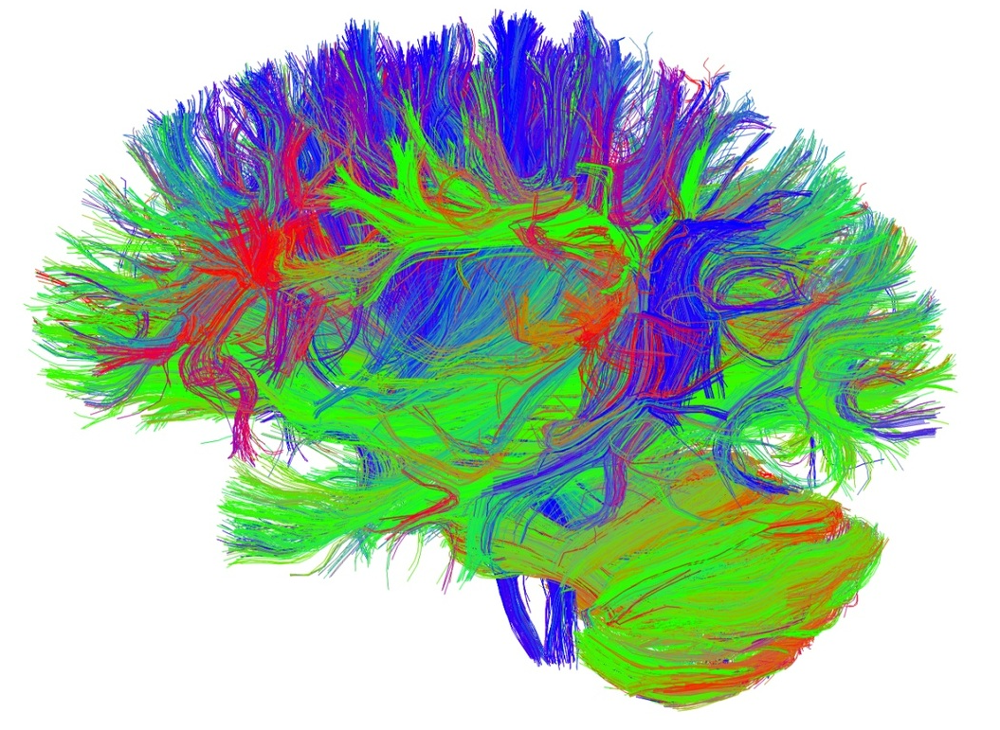
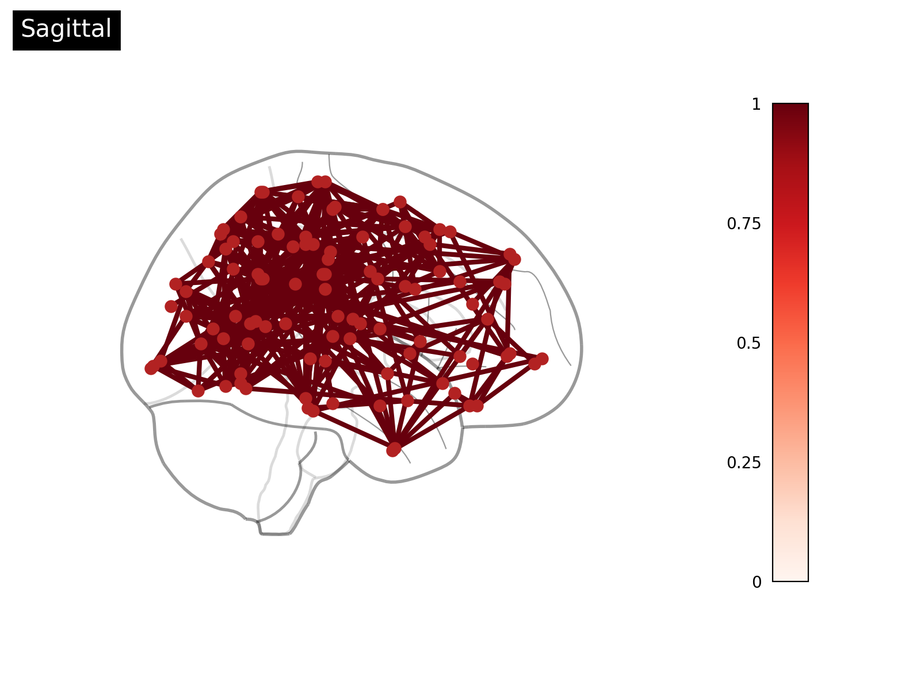
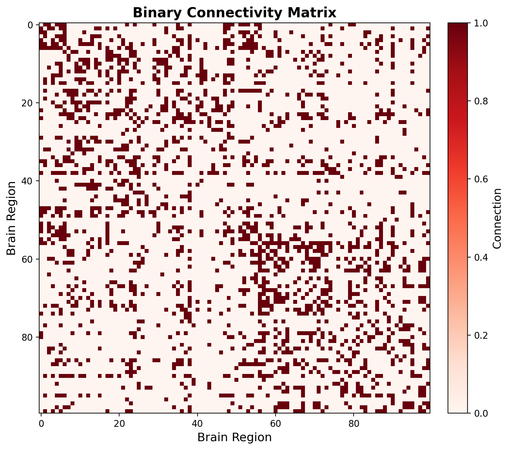

Welcome to our very first tutorial on **Generative Network Models**! 🎉

Before we dive into generating our own networks using `Python` (which we will do in all the upcoming tutorials!), we first need to understand *what* we are modeling and *why*. In this tutorial, we will explore the wonderful and complex world of brain networks!

# Why study the brain?

If we want to understand how cognition works, why bother looking at the messy, wet biology of the brain? Because the brain is the biological basis that *supports* cognition! Grounding our theories of cognitive functioning in actual biology ensures that our theories are plausible!!

To understand this better, let's make an example: Imagine a cognitive theory suggesting that our memories are stored like perfectly isolated "video files" or "books in a filing cabinet," where each memory lives in its own little box. If you forget something, someone just deleted the file! But if we look at the brain's actual biology, we know it doesn't have tiny hard drives. Instead, memories are distributed across a massively interconnected web of synapses. A "filing cabinet" theory is completely at odds with how the brain is actually structured!

### The brain as an interconnected network

Historically, neuroscience was dominated by the *localization of function* view: the idea that specific cognitive functions map neatly onto isolated, specific brain regions (think of the classic "language center" or "vision center"). On the flip side, some held a *holistic* view, arguing the entire brain works as one giant, undifferentiated blob.

Today, the modern consensus is that the brain relies on **both**! It involves:

-   **Functional Specialization**: Specific brain areas *do* have specialized roles.

-   **Global Integration**: These specialized areas must constantly communicate and integrate information across the whole brain to produce complex cognition.

Viewing the brain as an interconnected system of regions (rather than isolated islands) is the most powerful way to explain how the brain adapts, learns, and thinks.

### The brain, simplified

Imagine looking at a 3D model of a human brain, trying to map out its connections. The brain's "wiring" is made up of millions of nerve fibers called *white matter tracts*.

::: callout-note
## How do we even see white matter?

We can't just slice a living brain to see its wiring! Instead, we use a neuroimaging technique called **Diffusion Tensor Imaging (DTI)**. DTI measures how water molecules diffuse (move around) inside the brain. Since water moves more easily *along* the nerve fibers rather than *across* them, we can trace these water movements to reconstruct the brain's white matter pathways!
:::

While this 3D web of fibers is beautiful, it is also **super messy**. There are so many overlapping pathways that we cannot easily understand where all the specific connections start and end.

{width="50%" fig-align="center"}

To solve this, we use a **parcellation**. Instead of looking at millions of individual fibers, we divide the brain into distinct groups or "areas" (like mapping a country into states). Then, we simply count each **streamline** (a mathematical line estimating a bundle of white matter fibers) that leaves one area and reaches another.

By doing this, we instantly simplify the mess into a much cleaner **network**! {width="60%" fig-align="center"}

If you look closely at this new network, you'll see two main things:

-   **Nodes**: Represented as circles, they indicate distinct brain areas.

-   **Edges**: Represented as straight lines, each indicating the connection between two nodes.

By organizing things into nodes and edges, we have created a **graph**! A graph is simply a mathematical structure used to model relations between objects. This is incredibly useful because there is an entire branch of mathematics called **Graph Theory** that has been studying graphs for *centuries* (since 1736, to be exact!).

### From 3D Graphs to 2D Matrices

Okay, our 3D graph of nodes and edges is much better than the original white matter mess. But let's be honest... looking at a 3D glass brain is *still* visually overwhelming. The lines overlap, cross each other, and become a giant, jumbled ball of yarn! We can't actually see where all the specific connections go.

What if we moved from a messy 3D graph into a clean and ordered 2D grid?

Imagine a simple spreadsheet. We put our brain areas on the rows, and the same brain areas on the columns. Inside, we color each cell of this grid depending on *how strong* the connection is between those two areas (based on the streamline count).

{width="70%" fig-align="center"}

This 2D grid is called a **Connectivity Matrix**. Suddenly, everything is perfectly visible! The brain went from an absolute mess to something beautifully structured.

If we look at this matrix, we can instantly see structural patterns. For example, you might notice that the upper-left and lower-right quadrants of the spreadsheet have way more color than the rest of the grid! Why? Because there are many more *intra-hemispheric* connections (left-to-left or right-to-right) than *inter-hemispheric* connections (crossing from one hemisphere to the other).

We are already learning deep truths about how the brain is biologically organized just by looking at this matrix!

Because we turned the brain into a graph and its matrix, we can ask very cool questions about it, such as:

-   *Does this network contain **hubs**?* (Super-connected areas, like major airport terminals).

-   *What is the **shortest path** for information to travel from the visual area to the motor area?*

Without even realizing it, we are already doing **Network Topology** (studying the structural shape of the network)!!! This is what we will explore in intense detail in a following tutorial, but before we do that...

**Let's get everything installed!**

Before we can start measuring graphs and understand networks, we need to set up our Python environment and install the tools we need! We will walk through exactly how to install the `GenerativeNetworkModels` package and anything else we need (like `nilearn` or `networkx`) in the next tutorial. See you there!!