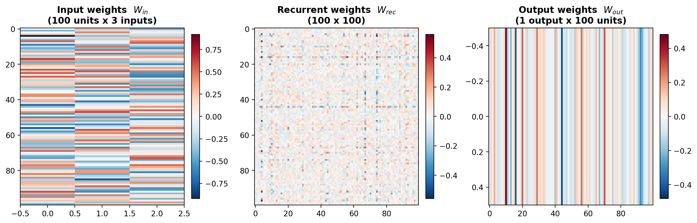
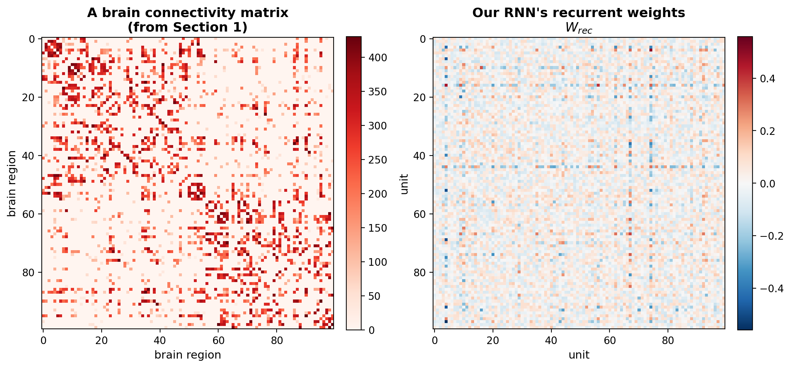
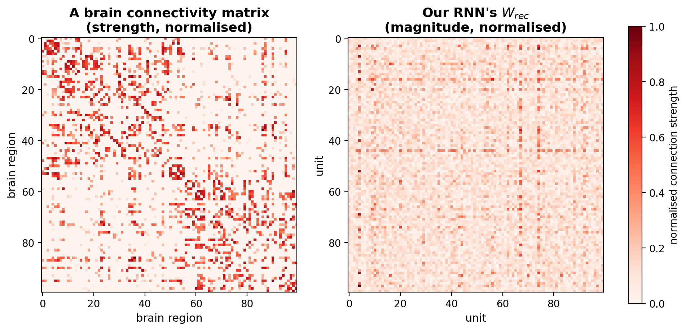
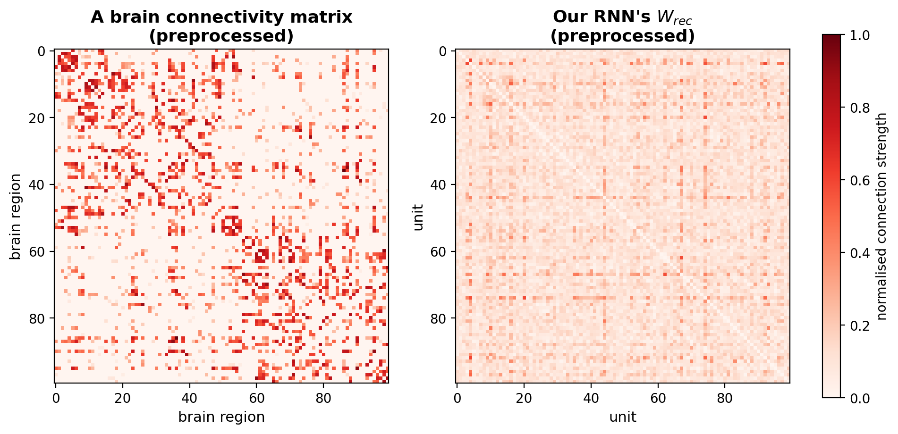

In the [previous tutorial](TrainingTheRNN.qmd) we trained our Leaky RNN until it solved the Go/No-Go task perfectly. Crucially, we never told it *how* to wire itself; we only ever rewarded it for getting the task right, and learning did the rest.

So what did it actually learn? Everything the network "knows" is stored in its weights, the numbers inside `W_in`, `W_rec` and `W_out`. Let's open it up and take a look.

## The three sets of weights, made visible

Recall the shape of our network: an input feeds the hidden units, the hidden units talk to each other, and the hidden units are read out into a response. Each arrow is one set of weights:

```{mermaid}
flowchart LR
    X["Input<br/>(3 channels)"] -->|W_in| H
    H["Hidden layer<br/>100 units"] -->|W_out| Y["Output<br/>(1 response)"]
    H -->|W_rec| H
```

Each of those weight matrices is just a grid of numbers, so we can plot each one as a heatmap. Red cells are positive weights, blue cells are negative, and the deeper the colour the stronger the weight:

{width="100%" fig-align="center"}

Let's read them left to right:

- **`W_in`** (100 × 3) holds the **input weights**. It has one column for each of our 3 input channels (fixation, Go, No-Go) and one row for each of the 100 units, so each column shows how that one cue is spread across the whole hidden layer.
- **`W_rec`** (100 × 100) holds the **recurrent weights**: how every unit influences every other unit. It's a big square grid, one row and one column per unit.
- **`W_out`** (1 × 100) holds the **output weights**: the 100 numbers that combine the units' activity into the single response.

Every one of those numbers started out random, and was slowly reshaped by those couple of thousand downhill steps until the network could do the task.

## Zooming in: `W_rec` is a connectivity matrix

Look again at the middle panel. Of the three, `W_rec` is special: it is **square**, with one row and one column for every unit. Its entry in row *i*, column *j* is simply *how strongly unit j drives unit i*.

Stop and notice what that is. A square grid, telling us who connects to whom and how strongly... that is **exactly a connectivity matrix**, the same object we spent all of Section 1 studying in real brains! Let's put them side by side:

{width="100%" fig-align="center"}

On the left is a brain connectivity matrix from Section 1; on the right is our RNN's `W_rec`. They are the **same kind of object**: a 100 × 100 grid of connection strengths. (This is no accident, it's exactly why we gave our network 100 units back when we built it: so that its `W_rec` and a 100-region brain network would line up cell-for-cell.)

They are quite different though!!! Here are some of the main differences:

- The brain matrix has only **positive values**: every connection has a strength (a streamline count), and that strength can only be zero or positive (you can't have a negative number of streamlines!). Our `W_rec` instead **signed**: its weights come in two flavours, positive (red, excitatory: one unit *excites* another) and negative (blue, inhibitory: one unit *suppresses* another).
- The values of the two matrices are quite different! The brain matrix goes to to 400, while the RNN stops at 0.4.
- The brain network is symmetric, the RNN is not! If we imagine a line cutting the matrix from upper-left to bottom-right, the two triangles are identical for the brain network (mirrored!) while quite different for the RNN...

So: same kind of object, but there are still some differences we need to take care of. Only then, we will be able to really test whether `W_rec` is *really* like a brain or not!

To answer that fairly, we need to do two things. First, deal with the fact that `W_rec` has **negative** weights while the brain's are all positive. Since we only care about the *strength* of each connection, not whether it excites or suppresses, we take the absolute value of `W_rec`:

``` python
import numpy as np

W_rec = np.abs(W_rec)   # turn signed weights into positive connection strengths
```

Then, normalise all the values so the two matrices are on the same scale. The brain's weights run into the hundreds while `W_rec`'s sit below one, so we rescale each matrix to the range 0–1 by dividing by its largest value:

``` python
brain = brain / brain.max()
W_rec = W_rec / W_rec.max()
```

Let's plot them again:

{width="100%" fig-align="center"}

Ok there's only one issue left, can you spot it!? Yep, it's the symmetry!!!

Why is our brain connectivity matrix so symmetric? Is the brain actually *that* symmetric? Well, not really. It has more to do with how we measure connectivity. When we look at white matter tracts in the MRI scanner, we can spot where the tracts are, but we have no information about the direction in which the information flows! Is a connection taking information from the visual cortex to the temporal one, or from temporal back to visual? With brain data, we cannot tell... But with the RNN's data, we can! We know if a connection goes from unit A to unit B, or from B to A!

So the fix is simple: we remove this information from the RNN data, and by doing that, make it symmetric! Let's do it:

``` python
# remove the directional information: average the two directions
W_rec = (W_rec + W_rec.T) / 2

# and drop the diagonal (self-connections), so it matches the brain
np.fill_diagonal(W_rec, 0)
```

{width="100%" fig-align="center"}

When making the RNN connectivity matrix symmetric, we also removed the diagonal. That way, it's completely matching the brain connectivity matrix.

Amazing!!! Now that the preprocessing is done, they are directly comparable. In the next tutorial, we will make this comparison by measuring their **topological properties** (as we did in our [tutorial on Topology](Topology.qmd)), instead of just eyeballing them. See you there! 🚀