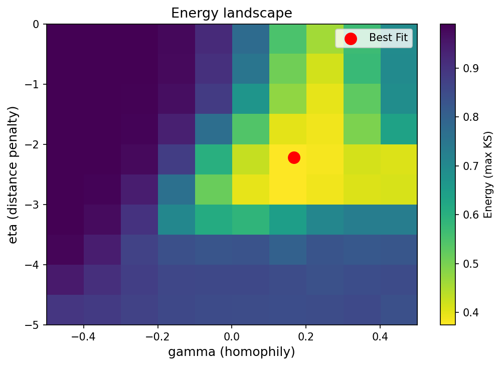

In the last tutorial we set everything up: we loaded the brains, defined the grid of η and γ values, and configured the sweep. Now we're ready to actually run it — and then figure out which parameters win!

But first, we need to answer one more question: how do we even decide whether a generated network is any good? That is exactly what this tutorial is about.

## The energy function

How do we measure how similar a generated network is to a real brain? The trick is to compare the **distributions** of four topological properties:

-   **Degree** - are the hubs as prominent as in the real brain?
-   **Betweenness centrality** - are the bottleneck nodes as central?
-   **Clustering coefficient** - are the local clusters as tight?
-   **Edge length** - are the connections as short or as long?

If those four metrics sound familiar, it's because they are exactly the ones we studied in the [Topology tutorial](Topology.qmd)! There we computed them to look for correlations with early life stress. Here we reuse them to judge how well a generated network reproduces the real brain's topology. Handy, right?

For each property, we compute a **Kolmogorov-Smirnov (KS) statistic**: a number between 0 and 1 measuring how far apart two distributions are.

-   **0** = the two distributions are identical (perfect fit!)
-   **1** = the two distributions are completely different (terrible fit!)

We then define the **energy** as the *worst* of the four KS values:

$$E(\eta, \gamma) = \max\!\left[\,\text{KS}_\text{degree},\;\text{KS}_\text{betweenness},\;\text{KS}_\text{clustering},\;\text{KS}_\text{edge length}\,\right]$$

Why take the maximum? Because we want the model to do well on *all four* metrics simultaneously. If we used the average instead, a model could cheat: nail three metrics and completely flop on the fourth, and still look okay on average. Taking the worst score instead means there is no escaping: you have to do well everywhere!

In code, the GNM toolbox handles all of this in just a few lines:

``` python
from gnm import evaluation

criteria = [
    evaluation.DegreeKS(),
    evaluation.BetweennessKS(),
    evaluation.ClusteringKS(),
    evaluation.EdgeLengthKS(distance_matrix),
]

energy = evaluation.MaxCriteria(criteria)
```

We create a list with our four KS criteria, then wrap them inside `MaxCriteria()`, which will automatically take the maximum across all four. That's it — our energy function is ready!

## Running the sweep

Now we can finally press go and launch the parameter sweep. We call `fitting.perform_sweep()`, and pass it all the pieces we have assembled so far: the sweep configuration, the energy function, and the real brain networks to compare against.

``` python
import time

DEVICE = torch.device("cuda:0" if torch.cuda.is_available() else "cpu")
print(f"Running on: {DEVICE}")

start = time.perf_counter()

experiments = fitting.perform_sweep(
    sweep_config         = sweep_config,
    binary_evaluations   = [energy],
    real_binary_matrices = binary_brains_tensor,
    save_model           = False,
    save_run_history     = False,
)

elapsed = time.perf_counter() - start
print(f"Sweep complete in {elapsed:.1f} s")
```

The function returns a list called `experiments`. Each entry in this list corresponds to one specific combination of η and γ. Since we tested 10 values of η × 10 values of γ, we end up with 100 experiments in total.

::: callout-note
## How long will this take?

With 10 η values × 10 γ values × 10 simulations = 1000 model runs, each compared against 20 real brains. On a laptop CPU this typically takes a few minutes. On a GPU it can be 10–100x faster. A good excuse for a coffee break!
:::

## Finding the best parameters

Now comes the fun part: which combination of η and γ produced the synthetic networks that best match the real brains?

Each experiment in our list already contains the energy scores. For a given experiment, the scores are stored as a matrix with shape `[simulations × brains]` — one energy value for each of our 10 simulations and each of our 20 brains. To summarise each experiment down to a single number, we take the mean across both simulations and brains:

``` python
import numpy as np

energy_key = str(energy)

mean_energies = [
    float(exp.evaluation_results.binary_evaluations[energy_key].mean())
    for exp in experiments
]
```

We now have one mean energy score per parameter configuration. We just need to find which one is smallest:

``` python
best_idx    = int(np.argmin(mean_energies))
best_exp    = experiments[best_idx]
best_energy = mean_energies[best_idx]

best_eta   = float(best_exp.run_config.binary_parameters.eta)
best_gamma = float(best_exp.run_config.binary_parameters.gamma)

print(f"Best energy : {best_energy:.3f}")
print(f"Best eta    : {best_eta:.2f}")
print(f"Best gamma  : {best_gamma:.2f}")
```

::: callout-note
We used `str(energy)` to look up the scores inside the experiment. The toolbox stores evaluation results in a dictionary where the key is the name of the energy function — `str(energy)` gives us exactly that name. Think of it as asking the toolbox: *"show me the scores for this specific energy function."*
:::

## The energy landscape

A single winning pair of numbers is informative, but the full **energy landscape** — a heatmap of energy across all η and γ combinations — tells a much richer story.

Since each experiment in our list corresponds to exactly one (η, γ) pair, we can directly build a tidy dataframe and pivot it into a 2-D grid:

``` python
import pandas as pd
import matplotlib.pyplot as plt

rows = []
for exp, e_val in zip(experiments, mean_energies):
    rows.append({
        "eta":    float(exp.run_config.binary_parameters.eta),
        "gamma":  float(exp.run_config.binary_parameters.gamma),
        "energy": e_val,
    })

df_sweep  = pd.DataFrame(rows)
landscape = df_sweep.pivot(index="eta", columns="gamma", values="energy")

fig, ax = plt.subplots(figsize=(7, 5))

im = ax.imshow(
    landscape.values,
    origin="lower",
    aspect="auto",
    cmap="viridis_r",
    extent=[
        landscape.columns.min(), landscape.columns.max(),
        landscape.index.min(),   landscape.index.max(),
    ],
)

ax.scatter(best_gamma, best_eta, color="red", s=120, zorder=5,
           label="Best Fit")

plt.colorbar(im, ax=ax, label="Energy (max KS)")
ax.set_xlabel("gamma (homophily)", fontsize=12)
ax.set_ylabel("eta (distance penalty)", fontsize=12)
ax.set_title("Energy landscape", fontsize=13)
ax.legend(fontsize=10)

plt.tight_layout()
plt.savefig("../images/GenerativeModels/energy_landscape.png", dpi=150)
plt.show()
```

{width="80%" fig-align="center"}

The landscape shows you at a glance:

-   **Where the model fits well** — the bright (low-energy) region shows the combinations of η and γ that produce synthetic networks closest to the real ones.
-   **How precise the optimum is** — a sharp, narrow valley means the brain's wiring is tightly constrained by these two parameters. A flat bright region means many different combinations work almost equally well.
-   **Whether the best parameters are biologically plausible** — we'll talk about what "plausible" means in the next section!

## What do the best-fitting parameters tell us?

A typical result for human structural brain networks sits somewhere around η between −2 and −3 and γ between 0.2 and 0.4. Let's think about what that actually means in plain language.

**η between −2 and −3**: the brain *does* strongly penalise long-range connections, but not to the extreme. It is not a pure "connect only your nearest neighbour" strategy. There is room for some long-distance wiring — which is exactly what you need to keep the brain integrated across hemispheres and lobes.

**γ between 0.2 and 0.4**: the brain favours homophily: regions that already share neighbours are more likely to become connected. This is the signature of **modular, clustered wiring** — a developmental programme that builds tight functional communities (visual network, motor network, default mode network) by preferentially connecting regions already embedded in the same neighbourhood.

Together, these two parameters capture the famous **small-world** architecture of the brain: cheap local connections (driven by η) combined with selective long-range bridges between clusters (enabled by γ). All from just two numbers — pretty elegant, isn't it!?

::: callout-important
## This is a group-level result

The best-fitting (η, γ) we found here describes the *average* pattern across our 20 brains. It answers the question: *what single wiring rule best reproduces the observed networks?*

But individuals differ! In the next tutorial, we will run an individual-level sweep to extract one (η, γ) per person, and then ask whether those individual differences correlate with early life stress.
:::
