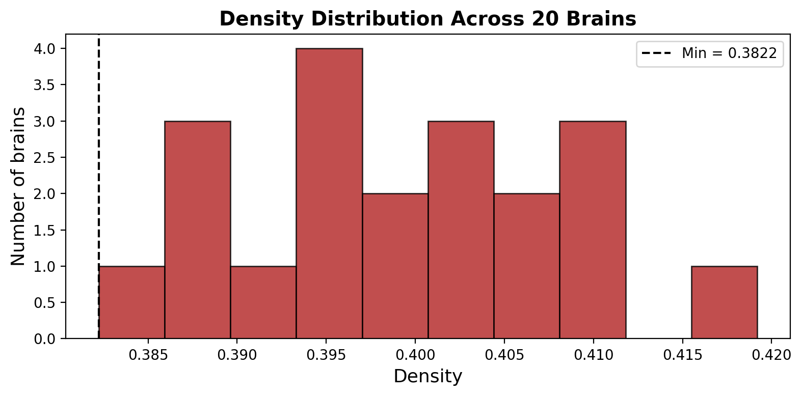

In the previous tutorial, we loaded our 20 brain networks and framed our research question. But before we can start analysing them, we need to make sure our data is **clean and comparable**.

This is a step that is often underappreciated: if our networks are not properly preprocessed, any analysis we run later could be misleading... or simply wrong!

In this tutorial, we will perform two essential quality-control checks:

1.  **Density check**: do all networks have the same number of connections? If not, we need to make them comparable.
2.  **Connectivity check**: is every network *fully connected*? That is, can you reach any brain region from any other?

Let's get started!

## Loading the Data

First, let's load our 20 brain networks:

``` python
import numpy as np

# Load the brain networks
brains = np.load("brain_networks_20.npy")
num_brains = brains.shape[0]
num_nodes = brains.shape[1]

print(f"Loaded {num_brains} brains with {num_nodes} nodes each.")
```

# Step 1: Checking Density

## What is density?

The **density** of a network is simply the proportion of all possible connections that actually exist. If a network with 100 nodes had *every single possible* connection, its density would be 1.0 (or 100%). In practice, brain networks are **sparse**: most possible connections don't exist, so densities are typically around 10-30%.

Why does this matter? Imagine comparing two people's brains, but one has 900 connections and the other has 1100. The second brain isn't necessarily *wired differently*; It might just have *more connections overall*. If we want to compare the **organisation** of two networks, they need to start on a level playing field: the same density!!!

## Introducing NetworkX

To work with networks in Python, we will use a library called `networkx`. The first thing we need to learn is how to **convert our matrix into a network object** that `networkx` can understand:

``` python
import networkx as nx

# Take the first brain as an example
brain_0 = brains[0]

# Convert the numpy matrix into a NetworkX graph
G = nx.from_numpy_array(brain_0)

print(f"This graph has {G.number_of_nodes()} nodes and {G.number_of_edges()} edges.")
```

What just happened? `nx.from_numpy_array()` reads our connectivity matrix and creates a **Graph object**. Each row/column becomes a node, and each non-zero cell becomes an edge. Now we can use all of `networkx`'s built-in functions on it!

For example, computing density is as simple as:

``` python
d = nx.density(G)
print(f"Density of brain 1: {d:.4f}")
```

Now let's compute the density for all 20 brains:

``` python
densities = []

for i in range(num_brains):
    G = nx.from_numpy_array(brains[i])
    d = nx.density(G)
    densities.append(d)
    print(f"Brain {i+1:2d}: density = {d:.4f}")

print(f"\nRange: {min(densities):.4f} to {max(densities):.4f}")
```

Let's also visualise the distribution:

``` python
import matplotlib.pyplot as plt

fig, ax = plt.subplots(figsize=(8, 4))
ax.hist(densities, bins=10, color='firebrick', edgecolor='black', alpha=0.8)
ax.set_xlabel('Density', fontsize=13)
ax.set_ylabel('Number of brains', fontsize=13)
ax.set_title('Density Distribution Across 20 Brains', fontsize=14, fontweight='bold')
ax.axvline(min(densities), color='black', linestyle='--', linewidth=1.5, label=f'Min = {min(densities):.4f}')
ax.legend()
plt.tight_layout()
plt.show()
```

{width="80%" fig-align="center"}

As you can see, the densities are **not identical** across our brains. This means we need to **threshold** them to make them comparable.

### Thresholding to a Common Density

Thresholding is straightforward: we simply keep the **strongest connections** and discard the weakest ones, until all networks have the same density.

But what density should we target? We use the **minimum density** across all brains. Why? Because we can only *remove* connections (we can't invent new ones!), so the sparsest brain sets the limit for everyone.

We'll use a handy function from the `netneurotools` package:

``` python
from netneurotools.networks import threshold_network

# Our target: the minimum density across all brains
target_density = min(densities)

# threshold_network expects a percentage (0-100), not a proportion!
target_retain = target_density * 100
print(f"Thresholding all brains to density = {target_density:.4f} (retain = {target_retain:.2f}%)")

# Threshold each brain
brains_thresholded = np.zeros_like(brains)

for i in range(num_brains):
    brains_thresholded[i] = threshold_network(brains[i],
                                              retain=target_retain)
    
    # Verify: check the new density
    G = nx.from_numpy_array(brains_thresholded[i])
    new_density = nx.density(G)
    print(f"Brain {i+1:2d}: {densities[i]:.4f} → {new_density:.4f}")
```

The `retain` argument tells the function what proportion of edges to keep, and since we set it to the minimum density, every brain now has exactly the same number of connections. We are on a level playing field!

## Step 2: Checking Connectivity

The second check is whether each network is **fully connected**. What does this mean? Imagine the brain network as a road system: a fully connected network means you can drive from *any* city to *any* other city, even if it takes multiple roads. A **disconnected** network means there are some cities that are completely cut off, no road leads to them.

Why is this a problem? Many of the network analyses we will run later assume you can travel between any two regions. If some regions are isolated, those analyses can break or give us nonsensical results.

Let's check:

``` python
# Check connectivity for each thresholded brain
disconnected = []

for i in range(num_brains):
    G = nx.from_numpy_array(brains_thresholded[i])
    connected = nx.is_connected(G)
    num_components = nx.number_connected_components(G)
    
    status = "✓ Connected" if connected else f"✗ DISCONNECTED ({num_components} components)"
    print(f"Brain {i+1:2d}: {status}")
    
    if not connected:
        disconnected.append(i)

if len(disconnected) == 0:
    print("\n🎉 All networks are fully connected!")
else:
    print(f"\n⚠️  {len(disconnected)} network(s) are disconnected: {[d+1 for d in disconnected]}")
```

::: callout-warning
## What if a network is disconnected?

If any network is disconnected, we have a few options:

1.  **Discard it**. Simply exclude it from further analysis. This is the simplest approach, but we lose data.
2.  **Threshold less aggressively**. Use a slightly higher target density to preserve connectivity. This approach might "save" some networks by making them more dense, but if you do this, the sparser networks will need to be excluded from the analysis!!! So either way, you'll end up losing some data.
:::

## Summary

Let's save our preprocessed networks for use in later tutorials:

``` python
# Save the preprocessed networks
np.save("brain_networks_20_preprocessed.npy", brains_thresholded)
print(f"Saved preprocessed networks with shape {brains_thresholded.shape}")
print(f"All networks now have density = {target_density:.4f}")
```

Here is what we accomplished:

| Check | What we did | Why it matters |
|------------------|------------------------|------------------------------|
| **Density** | Thresholded all networks to the minimum density | Ensures fair comparison: one brain having more connections doesn't skew results |
| **Connectivity** | Verified all networks are fully connected | Ensures our later analyses work correctly on every brain |

Our data is now clean and ready for analysis!!!!