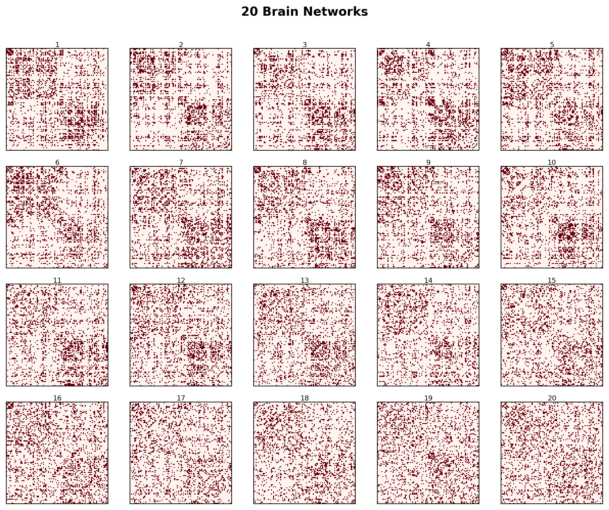

## Starting from Theory

Before we dive into any analysis, let's pause and remind ourselves of something crucial: **good research always starts with a strong theoretical background and a clear research question**.

It can be tempting to jump straight into the data, compute every metric we can think of, and see what "pops out." But that is a recipe for false positives and uninterpretable results. Instead, we should always begin by asking: *What do we expect to find, and why?*

So let's build our research question from the ground up.

### The Adaptive Stochasticity Hypothesis

Recent work by [Carozza and colleagues](https://www.pnas.org/doi/abs/10.1073/pnas.2307508120) has introduced a fascinating theoretical framework called the **Adaptive Stochasticity Hypothesis**.

The core idea is this: brain development is inherently *stochastic*, that is, the way connections form between brain areas is not fully deterministic, but involves a degree of randomness. Importantly, this hypothesis proposes that this randomness is not a bug: it can actually be **adaptive**.

Why would randomness be useful? Carozza et al. argue that in uncertain or adverse environments (such as those involving early life stress), brains that develop with *more* stochasticity may end up being *more resilient*. A more stochastic developmental process explores a wider range of possible network configurations, which could help the brain adapt to unpredictable circumstances.

Crucially, Carozza et al. tested this using **Generative Network Models** - the very same models we installed in the previous tutorial! They showed that children from disadvantaged backgrounds had brain networks that were better captured by more stochastic generative models (i.e., models with weaker distance and topological constraints).

## Our Research Question

Inspired by the Adaptive Stochasticity Hypothesis, here is the question we will investigate throughout the rest of these tutorials:

::: callout-important
## Research Question

**Do individuals who experienced higher early life stress show different brain network organisation, and can these differences be captured by the parameters of a generative network model?**
:::

To address this, we have a dataset of **20 brain networks** from 20 different individuals. Each individual also has an **early life stress score**, a measure of the adversity they experienced during development.

Our plan is to:

1.  **Explore the topology** of these 20 networks. Compute metrics like clustering, path length, and modularity to see if any relate to early life stress (next tutorials).
2.  **Fit generative network models** to each brain. Estimate the combination of generative parameters that best reproduce each individual's network.
3.  **Test whether these parameters correlate with early life stress**. The core prediction is that higher stress should be associated with more stochastic (less constrained) generative models.

### Loading our Dataset

Let's start by loading our 20 brain networks. You can download the full dataset here:





Each brain network is a 100×100 binary connectivity matrix, just like the one we saw in the previous tutorial. The full dataset is stored as a single array with shape `[20, 100, 100]`.

``` python
import numpy as np

# Load the 20 brain networks
brains = np.load("brain_networks_20.npy")
print(f"Dataset shape: {brains.shape}")
print(f"We have {brains.shape[0]} brains, each with {brains.shape[1]} nodes.")

# Load the early life stress scores
stress = np.load("stress_scores.npy")
print(f"Stress scores: {stress}")
```

Here are all 20 brain networks we will be working with:

{width="85%" fig-align="center"}

Each of these matrices represents a different individual's brain. They all look a bit different — and our goal is to figure out whether those differences relate to early life stress!

Now we have everything we need to start exploring! In the next tutorial, we will dive into **preprocessing** to make sure these networks are comparable and ready for analysis. See you there! 🚀