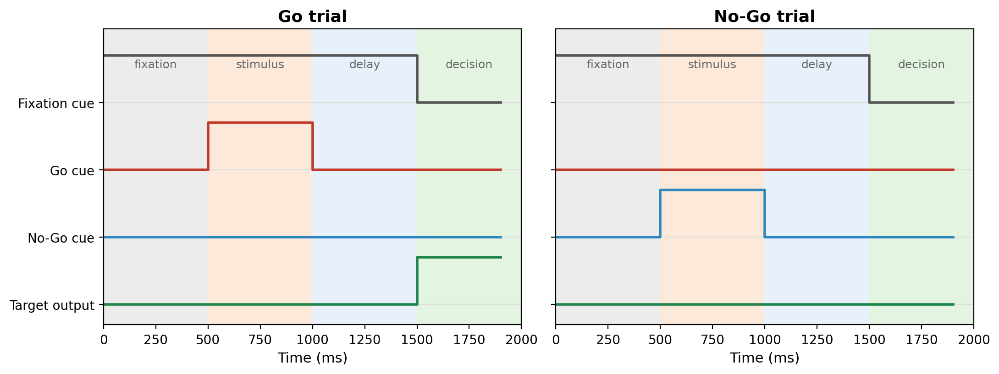

In the previous tutorial we met our new tool, the RNN: an input that brings information in, a hidden layer of recurrently connected units that compute through time, and an output that reads out a decision. We even saw that its $W_{rec}$ matrix is the same connectivity matrix we know and love from the GNMs.

But a network with nothing to do is a bit pointless! A brain is interesting because it *does things*, and so is an RNN. So before we build and train one, we need to give it a **task**.

In a cognitive task, a stimulus is presented, and the participant (a human, an animal, or in our case a network) has to respond, hopefully in the right way. There are **many, many** such tasks: perceptual decisions, working-memory tasks, categorisation, timing tasks... and so on. In fact, there are entire Python libraries dedicated to them!

::: callout-note
## A whole world of tasks

If you ever want to go further, the [**neurogym**](https://neurogym.github.io/) library collects dozens of cognitive tasks in a single, standardised format, ready to train networks on. Researchers even train a *single* network on **twenty tasks at once** to study how it reuses computations across them (this is the famous work of [Yang et al., 2019](https://www.nature.com/articles/s41593-018-0310-2)).

We won't use these libraries here. We'll build our one task **from scratch**, so that every moving part is visible and nothing is hidden behind a function call. But it's good to know this whole world exists!
:::

## Our task: Go/No-Go

We'll focus on one of the simplest and most classic tasks of all: the **Go/No-Go** task.

The rule could not be easier to state:

- When you see the **Go** cue → **respond**!
- When you see the **No-Go** cue → **do nothing**, hold back.

It sounds trivial, but it is a beautiful little test of **impulse control**: the hard part isn't responding to "Go", it's *resisting* the urge to respond when you should hold back. That ability to withhold a response is a cornerstone of what psychologists call **executive function**, and it's exactly the kind of skill that is shaped by development and, as we discussed at the very start of these tutorials, by experiences like early life stress. So Go/No-Go might eventually neatly tie back to our previous work!

## The anatomy of a trial

In our Go/No-Go task, each trial has the following structure:

1.  **Fixation**: nothing happens yet; the network must simply wait and hold still.
2.  **Stimulus**: the cue appears; either the Go cue or the No-Go cue.
3.  **Delay**: the cue disappears, but it's not time to respond yet. The network has to *remember* what it saw.
4.  **Decision**: finally, the network is allowed to act: respond on Go trials, stay quiet on No-Go trials.

How does the network know *when* it's allowed to respond? We give it a **fixation cue**: a signal that stays ON through fixation, stimulus and delay, and switches OFF at the decision period. As long as the fixation cue is on, the network should hold; when it drops, the network is free to act.

## Inputs and outputs

Let's make this concrete. Our network receives **three input channels**:

- a **fixation cue** (on until it's time to respond),
- a **Go cue** (on during the stimulus period, on Go trials),
- a **No-Go cue** (on during the stimulus period, on No-Go trials).

And it produces **one output**: whether it should respond or not. The response is present (coded as **1**) during the decision period on Go trials, and **0** otherwise (including the whole No-Go trial).

Here is what a single Go trial and a single No-Go trial look like:

{width="100%" fig-align="center"}

Notice how the only difference between the two trials is *which* cue appears during the stimulus period, and the network must use that to decide whether to respond a whole second later, during the decision period.

## Building the task in code

Now let's build our task, one piece at a time! Let's start by making a single trial: a Go trial.

The first thing we need is the **timing**. We have to define four durations: fixation, stimulus, delay and decision. They are all 500 milliseconds in our case:

``` python
import numpy as np

# period durations in milliseconds
fixation, stimulus, delay, decision = 500, 500, 500, 500
```

However, the network doesn't really compute every millisecond, but in **timesteps**! A timestep is just the small chunk of time the network advances by on each update. We'll make one timestep last 100 milliseconds (this can vary). We call this duration **`dt`**, short for *delta-t*: the amount of time that passes in a single step.

Knowing `dt`, we can re-express each period as a number of timesteps, and add them up to get the total length `T` of a trial:

``` python
dt = 100   # milliseconds per timestep

# turn milliseconds into a number of timesteps
n_fix  = fixation // dt   # 5 timesteps
n_stim = stimulus // dt   # 5 timesteps
n_del  = delay    // dt   # 5 timesteps
n_dec  = decision // dt   # 5 timesteps

T = n_fix + n_stim + n_del + n_dec   # 20 timesteps in total
```

It's also handy to mark *where* each period begins and ends, in timesteps. We'll use these markers in a second:

``` python
stim_on  = n_fix                    # stimulus starts at step 5
stim_off = n_fix + n_stim           # ...and ends at step 10
dec_on   = n_fix + n_stim + n_del   # decision starts at step 15
```

Great, we've got the timing down! Now let's fill in what actually happens on a Go trial.

A trial is really just a bunch of numbers laid out over time. Our network has **three input channels** (fixation cue, Go cue, No-Go cue), so we can store a whole trial in an array with one row per timestep and one column per channel. We start with everything at zero (nothing happening) and switch things on where we need them:

``` python
# a single Go trial: T timesteps × 3 input channels
x = np.zeros((T, 3))   # channel 0 = fixation, 1 = Go cue, 2 = No-Go cue

x[:dec_on, 0] = 1            # fixation cue ON until the decision period
x[stim_on:stim_off, 1] = 1   # Go cue ON during the stimulus period
```

Those two lines are the heart of it, so let's read them slowly:

- `x[:dec_on, 0] = 1` sets channel **0** (the fixation cue) to 1 from the very start up to the decision period, so it stays on through fixation, stimulus *and* delay.
- `x[stim_on:stim_off, 1] = 1` sets channel **1** (the Go cue) to 1 only during the stimulus period.

We also need to say what the network *should* do: its target output. That's another array, with one value per timestep, equal to 1 only during the decision period (when it should respond):

``` python
y = np.zeros((T, 1))   # the desired output, one value per timestep
y[dec_on:, 0] = 1       # respond during the decision period
```

And that's a complete Go trial: hold during fixation, see the Go cue, remember it through the delay, and respond at the decision!

### What changes for a No-Go trial?

Almost nothing! Only two things differ: the cue is now the No-Go cue (channel **2** instead of channel 1), and the target output stays all zeros, because the correct thing to do is... nothing.

``` python
x = np.zeros((T, 3))
x[:dec_on, 0] = 1            # same fixation cue
x[stim_on:stim_off, 2] = 1   # but now the No-Go cue (channel 2)

y = np.zeros((T, 1))         # target stays all zeros: hold back!
```

### Many trials at once: the batch

Showing the network one trial, then another, then another, is slow, and it gives a very noisy picture of how well it's doing. So instead we hand it a whole **batch** of trials at once: many trials sitting side by side. To do that, we add a *middle* dimension to our arrays, for the trials:

``` python
batch_size = 32

x = np.zeros((T, batch_size, 3))   # (time, trial, channel)
y = np.zeros((T, batch_size, 1))
```

Now we decide which of the 32 trials are Go and which are No-Go. We just pick at random, and remember the choice in `labels` (1 = Go, 0 = No-Go):

``` python
labels = np.random.randint(0, 2, batch_size)   # one label per trial
go, nogo = labels == 1, labels == 0            # which trials are which
```

Then we fill everything in exactly as before, but now applying each cue only to the trials it belongs to:

``` python
x[:dec_on, :, 0] = 1               # fixation cue on every trial
x[stim_on:stim_off, go,   1] = 1   # Go cue on the Go trials only
x[stim_on:stim_off, nogo, 2] = 1   # No-Go cue on the No-Go trials only
y[dec_on:, go, 0] = 1              # respond only on the Go trials
```

Here `go` and `nogo` simply pick out the Go trials or the No-Go trials, so each cue lands on the right ones.

### Putting it all together

That's every piece! Let's collect them into a single function, so we can generate a fresh batch of trials whenever we want:

``` python
import numpy as np

def generate_batch(batch_size=32, dt=100):
    # period durations in milliseconds
    fixation, stimulus, delay, decision = 500, 500, 500, 500

    # turn milliseconds into a number of timesteps
    n_fix, n_stim, n_del, n_dec = (fixation // dt, stimulus // dt,
                                   delay // dt, decision // dt)
    T = n_fix + n_stim + n_del + n_dec

    # where each period starts / ends
    stim_on  = n_fix
    stim_off = n_fix + n_stim
    dec_on   = n_fix + n_stim + n_del

    # 3 input channels (fixation, Go, No-Go) and 1 output
    x = np.zeros((T, batch_size, 3))
    y = np.zeros((T, batch_size, 1))

    # random Go / No-Go trials
    labels = np.random.randint(0, 2, batch_size)
    go, nogo = labels == 1, labels == 0

    x[:dec_on, :, 0] = 1               # fixation cue
    x[stim_on:stim_off, go,   1] = 1   # Go cue
    x[stim_on:stim_off, nogo, 2] = 1   # No-Go cue
    y[dec_on:, go, 0] = 1              # respond on Go decisions

    return x, y, labels
```

Call `generate_batch()` and you get back a fresh set of trials: the inputs `x`, the targets `y`, and the `labels`, all ready to feed to a network.

## What's next

We now have a job for our network: see a cue, hold it in mind through a delay, and respond (or not) at the right moment. We even have the code to generate as many trials as we want.

The only thing missing is... the network itself! In the next tutorial we'll **build the RNN** in code and watch it attempt the task *before* any training, to see just how badly an untrained network does. See you there! 🚀