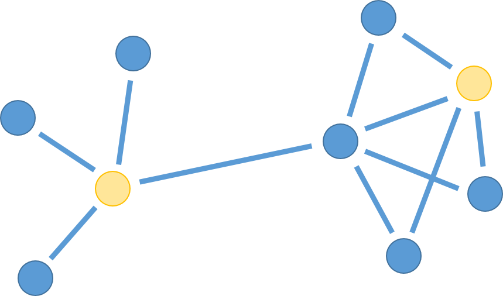
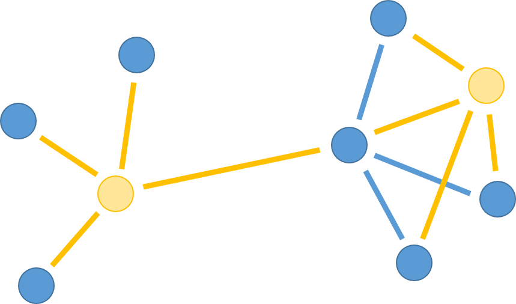
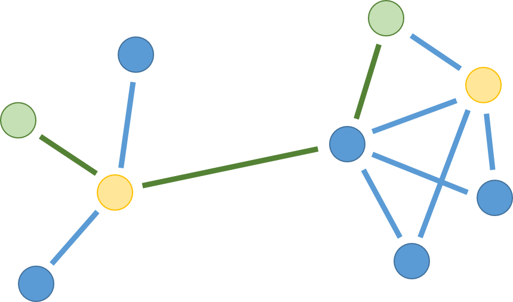
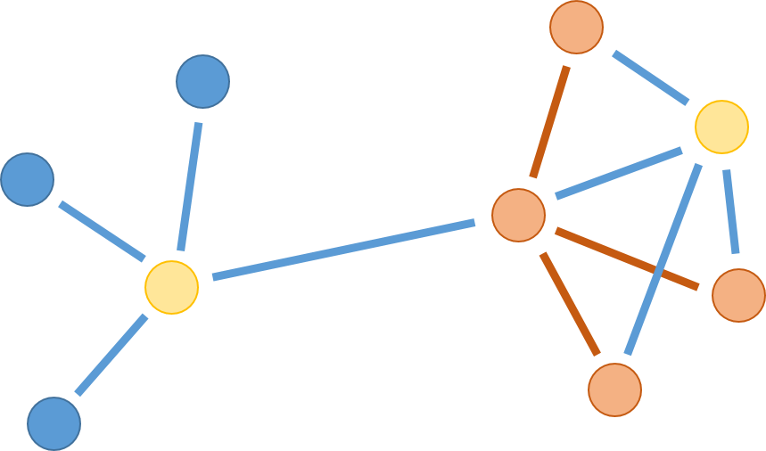
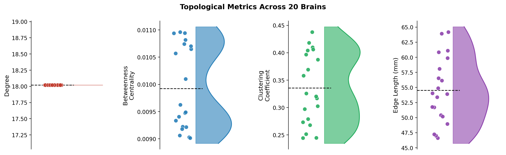
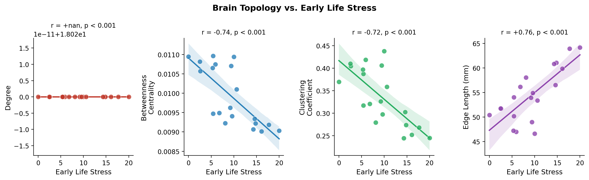

Now that we have imported and cleaned up our networks, we are ready to look into their topological properties!!!!

Let's remember our main goal here: we want to see if there is any correlation between brain networks and early life stress. So now we have to find a way to describe and compare these networks in some way: Which one is more efficient? Which one has more hubs? We can answer these questions and more by looking at their topology!

**Topology** is the study of the *shape* and *structure* of a network. By quantifying topology, we can boil a messy, tangled network down into a handful of meaningful numbers we can actually compare across people!

Topological measures are endless, and super confusing. When we started working on these metrics, we'd hear every time a new word: betweenness centrality, clustering coefficient, path length, modularity, rich-club coefficient, efficiency... It felt like a never-ending list!!!

Luckily for us, many other people have described topological measures before! And a handful of them turn out to be *especially* informative for brain networks. In this tutorial we will focus on four key metrics:

1.  **Degree**: how many connections does a node have?
2.  **Betweenness centrality**: how central is the node to the flow of information?
3.  **Clustering coefficient**: is the node part of a bigger cluster of interconnected nodes?
4.  **Edge length**: how long are the edges (that is: the white-matter tracts)?

Let's build up our intuition with a simple toy network first, then apply these measures to our real brain data!

## A toy network

To make things concrete, let's look at a small example network. The yellow nodes are the two "nodes of interest". We'll use them throughout to illustrate each metric.

{width="65%" fig-align="center"}

Notice anything? The network has two distinct regions: a loose "star" shape on the left, and a denser, more interconnected cluster on the right. The two regions are connected by a single bridge edge in the middle. This kind of structure, with local clusters connected by bridges, turns out to be very common in brain networks!

## Degree

The simplest topological measure is **degree**: the number of edges connected to a node. In the context of brain networks, a high-degree region is sometimes called a **hub**: a brain area that talks directly to many other areas.

In the figure below, the yellow/orange edges highlight the connections of the two yellow nodes:

{width="65%" fig-align="center"}

The left yellow node has **degree 4**: it connects to its three close neighbours *plus* the bridge edge leading to the right cluster. And the right yellow node also has **degree 4**!

### Computing degree in Python

With `networkx`, degree is trivial to compute:

``` python
import numpy as np
import networkx as nx

# Load the preprocessed brains
brains = np.load("brain_networks_20_preprocessed.npy")
num_brains = brains.shape[0]

# Example: degree of every node in the first brain
G = nx.from_numpy_array(brains[0])
degrees = dict(G.degree())
print(f"Mean degree: {np.mean(list(degrees.values())):.2f}")
```

We are usually less interested in a single node's degree than in the **average degree** across the whole network, or the shape of the **degree distribution** across the whole network (are degrees roughly equal across nodes, or do a few mega-hubs dominate?).

For now, let's compute the mean degree across all 20 brains:

``` python
mean_degrees = []

for i in range(num_brains):
    G = nx.from_numpy_array(brains[i])
    mean_deg = np.mean([d for _, d in G.degree()])
    mean_degrees.append(mean_deg)
    print(f"Brain {i+1:2d}: mean degree = {mean_deg:.2f}")
```

## Betweenness Centrality

Degree tells us who is *popular* (many direct connections), but it misses something important: a node can be *strategically positioned* even without being especially well-connected. Think of a small airport that is the only hub between two continents: it handles an enormous amount of traffic despite being tiny!

**Betweenness centrality** captures exactly this idea. For each node, it counts what fraction of all shortest paths between *other* pairs of nodes pass through it. Wait a minute, what's a shortest path you ask!? Well, we have an example ready for you here below: if you want to connect the two green nodes to each other, what is the smallest amount of nodes you must go through?

{width="65%" fig-align="center"}

Just 2! And we're passing through the left yellow node!!! This means this node might have high beteenness centrality. Actually, *every single path* from any of its three close neighbours to anywhere on the right side of the network must pass through it. It is an absolute bottleneck!

Instead, the right yellow node is not as important. If we look closely, there is NO shortest path between two nodes that passes through it!!

### Computing betweenness in Python

``` python
betweenness_all = []

for i in range(num_brains):
    G = nx.from_numpy_array(brains[i])
    bc = nx.betweenness_centrality(G, normalized=True)
    mean_bc = np.mean(list(bc.values()))
    betweenness_all.append(mean_bc)
    print(f"Brain {i+1:2d}: mean betweenness = {mean_bc:.4f}")
```

::: callout-note
## What does `normalized=True` mean?

With `normalized=True`, NetworkX divides each node's raw betweenness count by the total number of node pairs in the network. This makes the values comparable across networks of different sizes. Since all our brains have 100 nodes, it does not matter much here, but it is good practice!
:::

## Clustering Coefficient

So far we have looked at how *many* connections a node has (degree) and how *strategically placed* it is (betweenness). The **clustering coefficient** asks a different question: are a node's neighbours also connected *to each other*?

Imagine a group of friends. If all your friends also know each other, your social network is highly clustered: you live in a tight-knit community. If none of your friends know each other, your clustering is zero: you are a bridge between disconnected social circles.

::: callout-warning
## This example does not apply to Francesco and Tommaso because they have no friends
:::

If we look at the two yellow nodes, we can color with orange the connections between their neighbors:

{width="65%" fig-align="center"}

The nodes in the right cluster are well connected to each other. This gives them **high clustering**. By contrast, look at the left yellow node: its three close neighbours have no edges between them at all!! They are connected to the hub but not to each other... so the hub has **low clustering**!

This difference maps beautifully onto brain organisation. Tightly clustered brain regions tend to form **functional modules** (groups of regions that work closely together on a shared task). The brain is known to have many such modules: a visual module, a motor module, a default mode network... And high clustering is one of its signatures.

### Computing clustering in Python

``` python
clustering_all = []

for i in range(num_brains):
    G = nx.from_numpy_array(brains[i])
    clust = nx.clustering(G)
    mean_clust = np.mean(list(clust.values()))
    clustering_all.append(mean_clust)
    print(f"Brain {i+1:2d}: mean clustering = {mean_clust:.4f}")
```

## Edge Length

The last metric we will cover is **edge length**. Unlike the previous three measures, this one is not purely topological; it brings in the actual physical geometry of the brain!

Remember: each node in our network is a brain region with a real 3D location in the brain (in MNI coordinates). Each edge represents a white matter tract connecting two of those regions. The **length** of an edge is simply the **Euclidean distance** between the two regions it connects: how far apart they physically are in the brain.

Why does this matter? The brain has limited space and wiring is metabolically expensive. Longer axons cost more energy to build and maintain, so the brain generally prefers *short-range* connections. A network dominated by short edges is metabolically cheap but has limited reach. A network with more long-range edges is more expensive but can integrate information across the whole brain much more efficiently.

This is also deeply relevant to **Generative Network Models**, but we'll worry about this later!!!

### Computing edge length in Python

We have a file with the 3D coordinates of all 100 brain regions, and a precomputed distance matrix. Let's load them:

``` python
# Load node coordinates (100 x 3: x, y, z in MNI space)
coords = np.load("coordinates.npy")

# Load the precomputed pairwise Euclidean distance matrix (100 x 100)
D = np.load("distance_matrix.npy")
```

::: callout-note
## What's in the distance matrix?

`distance_matrix.npy` contains the Euclidean distances between all 100 brain regions, in millimetres. Entry `D[i, j]` is simply `np.sqrt(sum((coords[i] - coords[j])**2))`. We precomputed it so you don't have to recompute it every time, but it is trivial to recompute yourself if needed!
:::

To get the mean edge length for a brain, we just look up the distance for every existing edge and average them:

``` python
edge_length_all = []

for i in range(num_brains):
    # Find all connected pairs (upper triangle only, to avoid double-counting)
    edges = np.triu(brains[i], k=1) > 0
    mean_len = D[edges].mean()
    edge_length_all.append(mean_len)
    print(f"Brain {i+1:2d}: mean edge length = {mean_len:.2f} mm")
```

That's it! Just averaging the distances of existing edges.

## Putting it all together

Now let's compute all four metrics at once for all 20 brains and store them neatly:

``` python
import pandas as pd

results = []

for i in range(num_brains):
    G = nx.from_numpy_array(brains[i])

    mean_deg  = np.mean([d for _, d in G.degree()])
    mean_bc   = np.mean(list(nx.betweenness_centrality(G, normalized=True).values()))
    mean_clust = np.mean(list(nx.clustering(G).values()))
    path_len  = nx.average_shortest_path_length(G)

    results.append({
        "brain":        i + 1,
        "degree":       mean_deg,
        "betweenness":  mean_bc,
        "clustering":   mean_clust,
        "path_length":  path_len,
    })

df = pd.DataFrame(results)
```

And here's how they look when plotted! {width="100%" fig-align="center"}

::: callout-note
## Degree and density

Wait a second, what's with degree!?? Why is it the same for all brain networks!?

If you remember, we thresholded all our networks to the same density in the previous tutorial... So every brain will have the *same* mean degree! This is expected: density and mean degree are mathematically linked. The interesting variation is not in the *average* degree but in how degree is *distributed* across nodes: some brains might have more extreme hubs than others even at the same density. We'll see this in one of the following tutorials!
:::

## Do these metrics relate to early life stress?

Remember our research question: do individuals who experienced higher early life stress show different brain network organisation? Now that we have our topological metrics, we can take a first look!

``` python
from scipy import stats

stress = np.load("stress_scores.npy")

metrics = ["degree", "betweenness", "clustering", "path_length"]

print("Correlation with early life stress:\n")
for m in metrics:
    r, p = stats.pearsonr(df[m], stress)
    print(f"  {m:>15s}: r = {r:+.3f},  p = {p:.3f}")
```

{width="100%" fig-align="center"}

AFTER 5 FULL TUTORIALS, FINALLY SOME RESULTS!!! Let's interpret them!

Well, degree doesn't really work as we have seen: all networks have the same average degree! What about the other three? The effects seem pretty strong!!

If we were to interpret this result, we'd say that participants with GREATER early life stress end up having brains that have LOWER betweenness centrality and clustering coefficient, but LONGER connections. If we interpret this in light of the adaptive stochasticity hypothesis, this is evidence favoring the idea that brains shaped by adversity develop in a more stochastic, less constrained way: with fewer critical bottleneck regions and a more distributed, decentralised architecture

These results are a bit weak and messy though... That's why we need better modelling tools, just like generative network models!!!! See you on the other side!!!

::: callout-important
## This is just an example!

Remember: we have 20 participants. The idea here is to have a small toy dataset that it's easy to play with. But with such a small sample, any correlation we find here should be treated as a very preliminary observation, not a definitive result.
:::

##