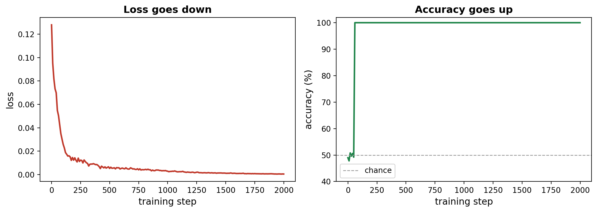
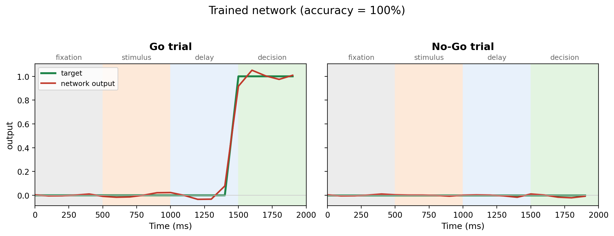

In the [previous tutorial](BuildingTheRNN.qmd) we built our Leaky RNN and watched it flail at the Go/No-Go task: **50% accuracy**, pure guessing. Its wiring (`W_in`, `W_rec`, `W_out`) is all in place, but the actual numbers inside those weights are random and meaningless.

This tutorial is about the one thing that fixes that: **learning**.

## How does a network learn?

Our network has thousands of weights, all the numbers spread across `W_in`, `W_rec` and `W_out`. "Learning" just means finding good values for all of them. We obviously can't set thousands of numbers by hand, so we let the network find them itself, with a surprisingly simple recipe:

1.  Show it some trials and measure **how wrong** it is, as a single error score.
2.  Work out, for every weight, **which way to nudge it** to make that error score a little smaller.
3.  Take a tiny step in that direction.
4.  Repeat (Thousands of times!!!)

Here's the picture to hold in your head. Imagine hiking down a mountain in thick fog. You can't see the valley below, but you *can* feel the slope under your feet, so you take a small step downhill, then feel again, then step again. Do that for long enough and you reach the bottom.

That's exactly what learning is here. The "height" of the mountain is how wrong the network is (we'll call it the **loss**), the "downhill direction" is called the **gradient**, and following it step by step is called **gradient descent**.

The part that sounds impossible, working out the downhill direction for *every single weight at once*, is done for us automatically by PyTorch. (This is the "magic" we mentioned when we first introduced PyTorch; its proper name is **backpropagation**.) So we never have to do any of that maths ourselves. We just have to set things up.

## Measuring how wrong it is: the loss

First we need to turn "how wrong" into one single error score.

Recall that the network produces an **output** at every timestep, and that our task gives us a **target** `y` (the correct response) for every timestep too (0 while the network should stay quiet, and 1 during the decision period of a Go trial). So at each timestep we can simply look at the *gap* between what the network did and what it should have done.

We measure that gap with the **mean squared error**: for every timestep we take `(output - target)`, **square** it (so that overshooting and undershooting both count as positive error, and big mistakes count for extra), and then **average** over all timesteps and all trials:

``` python
loss = ((outputs - y) ** 2).mean()
```

A perfect network gives a loss of 0; a hopeless one gives a big loss. This single number is the "height" we're going to drive downhill.

## Nudging the weights: the optimizer

Knowing how wrong we are, we need something that actually *does* the nudging. That something is an **optimizer**. We'll use a popular, reliable one called **Adam**:

``` python
optimizer = torch.optim.Adam(model.parameters(), lr=3e-4)
```

Two things to notice. `model.parameters()` hands the optimizer all the weights it is allowed to adjust (every number in `W_in`, `W_rec` and `W_out`). And `lr` is the **learning rate**: the size of each downhill step. Too big and we overshoot and the training becomes unstable; too small and learning crawls.

With the optimizer in hand, the actual learning happens in just **three lines**, which we run over and over:

``` python
optimizer.zero_grad()   # clear the downhill directions from the previous step
loss.backward()         # backprop: work out the downhill direction for every weight
optimizer.step()        # nudge every weight one small step downhill
```

Take a moment with these, because they are the beating heart of essentially *all* deep learning:

- `loss.backward()` is the clever one: this is backpropagation, where PyTorch figures out, for every weight, which way is downhill.
- `optimizer.step()` then takes the actual step, adjusting every weight a little.
- `optimizer.zero_grad()` just tidies up, clearing the directions from the previous step so they don't pile up. (We do it first thing each round.)

## The training loop

Now we simply put it all together and repeat. Each pass through the loop is one **training step**: make a fresh batch of trials, run them through the network, measure the loss, and take one step downhill.

``` python
model = LeakyRNN(n_input=3, n_hidden=100, n_output=1)
optimizer = torch.optim.Adam(model.parameters(), lr=3e-4)

for step in range(2000):
    # a fresh batch of trials
    x, y, labels = generate_batch(batch_size=128)
    x = torch.tensor(x, dtype=torch.float32)
    y = torch.tensor(y, dtype=torch.float32)

    outputs = model(x)                  # run the network
    loss = ((outputs - y) ** 2).mean()  # how wrong was it?

    optimizer.zero_grad()               # the three lines
    loss.backward()                     # that make
    optimizer.step()                    # learning happen
```

That's the whole thing. Two thousand tiny downhill steps, and our network goes from guessing to solving the task.

## Watching it learn

If we record the loss and the accuracy as training goes, we can watch it happen:

{width="100%" fig-align="center"}

The **loss** (left) falls steadily, step after step, exactly like our hiker descending into the valley: each downhill step makes the network a little less wrong.

The **accuracy** (right) tells the same story but more abruptly. That's because accuracy is a strict, all-or-nothing measure (did the network end up on the correct side of 0.5?), so it leaps from chance (50%) up to **100%** as soon as the outputs are pointed the right way, and then sits there while the loss keeps quietly refining them.

::: callout-note
## Your numbers will vary

Training starts from random weights and uses random batches, so if you run this yourself the exact curve will look a little different each time (and reaching 100% might take a few more or fewer steps). The overall story, loss down and accuracy up, is always the same.
:::

## The trained network in action

Numbers are nice, but let's *see* what the trained network actually does, on a Go and a No-Go trial:

{width="100%" fig-align="center"}

Compare this to the untrained network from the [last tutorial](BuildingTheRNN.qmd), which barely twitched. Now, on the **Go trial**, the output stays quiet through fixation, stimulus and delay, and then jumps cleanly up to 1 exactly when the decision period arrives. On the **No-Go trial**, it stays quiet the whole way through. The network has learned to *see* the cue, *hold* it in mind across the delay, and *respond* at the right moment, while withholding when it should. 100% accuracy.

## What's next

Here's the remarkable thing to sit with. We never told the network how to wire itself. We only ever rewarded it for getting the task right. And yet, in learning to do so, it has settled on a very particular set of recurrent weights, a specific 100 × 100 `W_rec` matrix.

Which is, of course, a **connectivity matrix**, the very same kind of object we spent the whole first half of these tutorials studying in real brains.

So the natural question is irresistible: does a network that simply learned to perform a cognitive task end up wired anything like a real brain? In the next tutorial, we crack ours open and take a look. See you there! 🚀