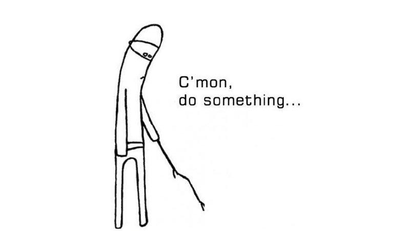

Look how far we've come!! In the first two sections we did two big things. First, we *described* brain networks: we measured their topology and asked whether it relates to early life stress. Then, we *grew* brain-like networks with GNMs: we found a tiny set of wiring rules that create artificial brains that resemble real ones.

Those artificial brains have one big limitation: they are like a **map**, and a map doesn't *do* anything... It just gives us a very informative but completely **static** picture.

Wouldn't it be amazing if this same matrix could come to life? If it could take in some information, let it ripple through all those connections, and spit out an answer? If only it could *do something...*

{width="55%" fig-align="center"}

Well. Funny you should ask. 😏

This is where the **Recurrent Neural Network (RNN)** comes in. At the heart of RNNs, there is a connectivity matrix which tells us who's wired to whom, and how strongly. That is quite similar to what we had in GNMs! In RNN-land though, this matrix has a specific name: it's called the **recurrent weight matrix** (people usually write it $W_{rec}$).

So why is this version not just another static map? Because in the RNN, **the units are alive with activity**. Each unit holds a number representing how active it is right now, and that activity *flows along the connections*: when one unit becomes active, it sends a signal through the matrix that nudges another unit, which nudges another, and so on.

::: callout-note
## A note on words: "nodes" vs "units"

In the brain-networks and GNM tutorials we called the dots in our network **nodes** — that's the term from graph theory. In neural-network land, people call the very same thing **units** (or sometimes "artificial neurons"). It's the exact same idea — a single element of the network that connects to others — just a different word borrowed from a different field. Now that we've crossed into RNN territory, we'll mostly say **units**.
:::

Okay, just by hearing the description, these RNNs sound a lot like real brains: complex networks that show patterns of activity. **So here's the big question: Are RNNs really similar to brains? In the following tutorials, we will set out to explore this. We will create our own RNN, and we will compare it to real brains!!!**

But hold on, we keep saying that RNNs "active" and that activity "flows" in the networks. What does that actually mean, and where does the activity even come from? To really understand that, let's follow the activity through the network one step at a time. It all starts with the input.

## Where the activity comes from: the input

Activity has to come from somewhere! That "somewhere" is the **input**. Something arrives from the outside world (a stimulus, a cue, a signal from the senses) and gets delivered to our units to kick things off. The delivery is handled by a dedicated set of weights, the **input weights**, whose only job is to carry the incoming signal in and spread it across the units.

You can picture this like the senses feeding a signal into the cortex: the eyes see something, and that information is routed in to get the neurons going.

## Where the activity goes: the output

Great, the activity is coming from somewhere, but where does it go? The network isn't active just for the sake of it: in the end, it has to **produce something**. A decision. A response. An answer.

That final step is the **output**, handled by another dedicated set of weights, the **output weights**. These look at how active the units are and translate that activity into the network's response.

So now we have a simple chain: an input comes in, the units light up, and an output comes out. But if that were the whole story, the information would only be passing straight through from input to output. What makes an RNN special is the set of connections we have started off with... the recurrent weights, our $W_{rec}$ matrix that was to similar to the static matrix created by the Generative Network Models. Let's see why!

## Computing through Time

So why are the recurrent weights the special ingredient? There are two reasons.

**First, this is where the actual computing happens.** The input and output weights are really just the network's *doors*: the input weights let information *in* from the world, the output weights let a decision *out*, each in a single pass. The recurrent weights are different. They pass activity *among the units themselves*, and as one unit's activity is blended with all the others, it gets **transformed**. That reshaping and combining of activity is exactly what computation *is*.

**Second, it doesn't compute just once.** The network moves through time: It moves forward in small steps, and at every step the recurrent weights take the units' current activity and transform it into the activity for the next step. Then they do it again, and again: the same matrix applied over and over, **through time**. That endless re-computing is exactly what the word *recurrent* is pointing at.

And it comes with a wonderful side effect. Because each step is built from the one before, information doesn't just vanish the instant it arrives: it can **carry forward and build up**. The network gains a **memory**, holding on to what happened and letting it shape what it does next, just like our brains do!!!

## Putting the pieces together

And that's the whole thing! An RNN is really just **three pieces**:

1.  An **input** that brings a stimulus in from outside.
2.  A **hidden layer** of recurrently connected units (this is where $W_{rec}$, our connectivity matrix, lives!) that buzz with activity and pass signals around in loops.
3.  An **output** that reads out the activity and produces a decision.

You now have all the pieces: input → recurrent hidden units → output, each governed by its own set of weights. This way, networks can start being alive and doing things!

Well, that is, if we give them something to *do*. In the next tutorial we'll design its job: a classic test of impulse control called the **Go/No-Go task**. See you there! 🚀