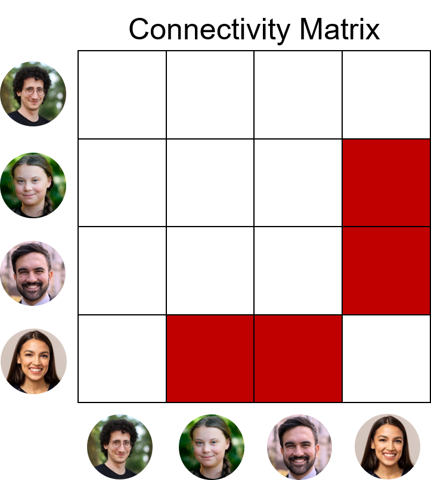
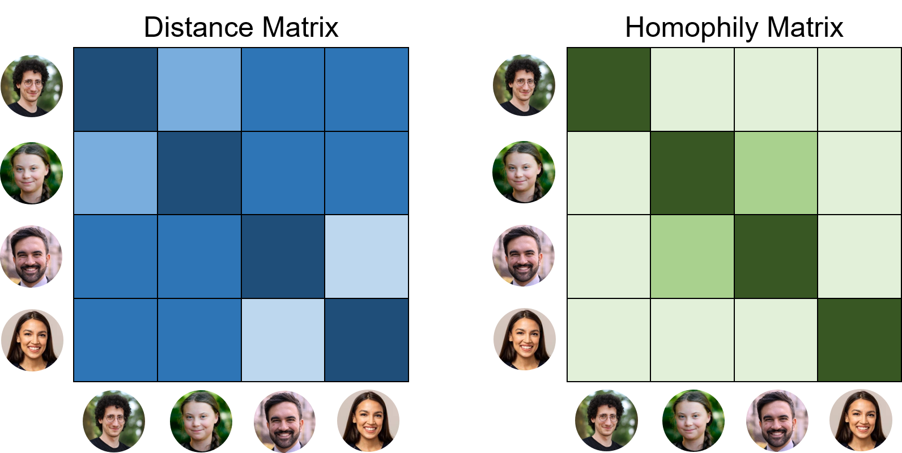
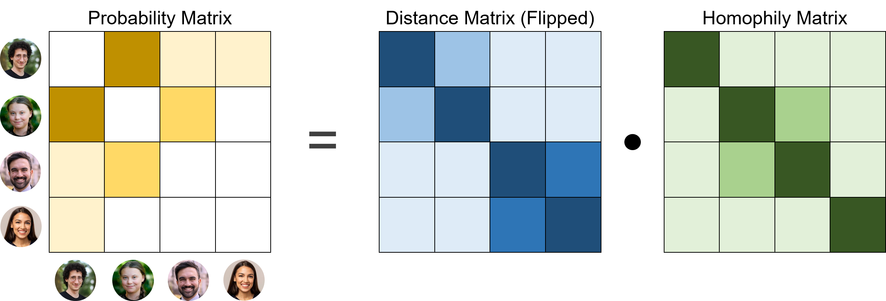
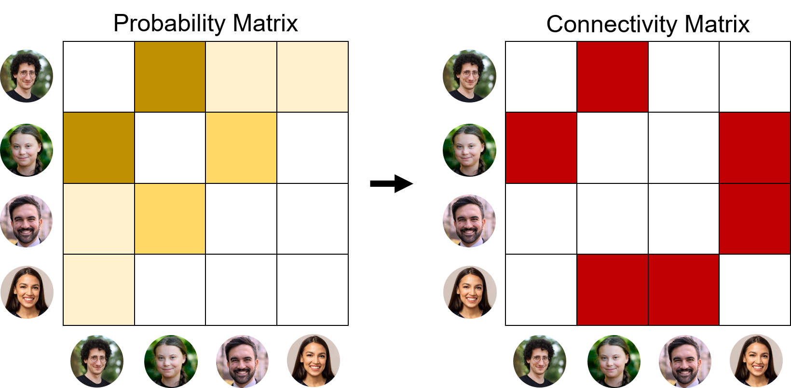
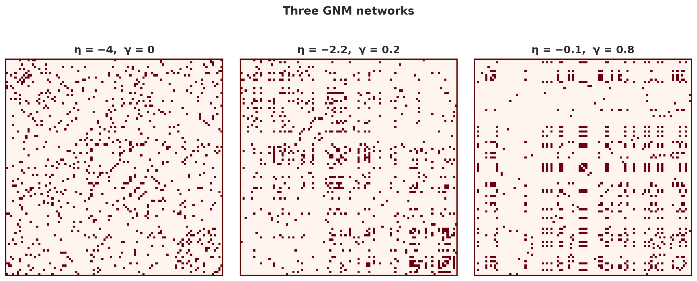

Remember where we left off? After five full tutorials, we finally correlated our topology metrics with early life stress and the results were... underwhelming. One significant correlation, a few weak trends, and a lot of noise.

That's not necessarily a failure. It actually tells us something important: **a handful of summary statistics may not be enough to capture the full richness of how brains are organised**.

So what else can we do?

What if instead of just *describing* a brain network, we tried to *grow* one? What if we could find a simple set of rules that explains how the brain wires itself, and then see whether those rules differ between people with different early life experiences?

That's exactly what **Generative Network Models (GNMs)** let us do. With GNMs, we start with an empty network and keep adding connections. How do we decide where to add connections, you may ask!? We follow what we call wiring rules. While there are many rules that people have used and new ones we could come up with, here's the two rules we will follow:

1.  **If two brain regions are closer to each other in space, they are more likely to connect.** That's because making a connection is metabolically expensive and the brain prefers cheaper and shorter connections where possible.
2.  **If two brain regions are connected to the same regions, they are more likely to connect.** Think of it as: If you and I don't know each other BUT we have the same friends, it's pretty likely we will connect at some point! It's the same for brain regions: if they have similar buddies, they will end up being buddies.

So when we have to decide what brain regions (nodes) should connect, we won't guess at random but follow these rules!

## A simple recipe for growing a brain

Let's turn on the math side of things just for a second. We usually try to keep the tutorials as math-free as possible, but when using GNMs, you will see this formula down here so often that we might just as well get over it and understand it as best as we can!! So here it is:

$$ P_{ij} \propto D_{ij}^{\eta} \cdot K_{ij}^{\gamma} $$That's it. The whole model lives in that one equation. If we think of i and j as two nodes, P is the probability that they will connect. That's what we use the wiring rules for, to decide if two nodes will connect!

On the right side of the \propto sign, we have the letters D and K. In a sense, these are the rules. D is for the distance rule, and K is for the "same friends" rules. Because scientists have to use complicated words and "similar friends" was too easy, so they called this "homophily".

::: callout-note
## Fun fact

"Similar friends" and "homophily" actually have the same exact meaning!!

The word "friend" originates from the Old English frēond, meaning "one who loves".

The word homophily comes from the greek words "homo", which means same, and "philia", which means love!!!
:::

And then there are two more greek letters, $\eta$ (eta) and $\gamma$ (gamma). These two are the elements that tell us how important each rules is! We'll come on these in a bit.

If all seems clear so far, here's the catch: Do you remember how it is simpler to treat brain networks as connectivity matrices? Well, P, D and K are also matrices!!!!

If you're head hasn't exploded and you're still alive, you're in luck, because an easy example to understand what this means is coming up next.

## The example of social networks

When getting started with GNMs, it can be quite confusing because there are lots of matrices interacting with each other. But once we learn how to read matrices, we will realize that the fundamental operations behind generative models are simpler than it looks! So just for practice, let's do a very simple generative model of... a social network!

Just as we can have a connectivity matrix with different brain regions, we can also have a connectivity matrix with people! In our case, we have only four people: Francesco, Greta, Zohran, and Alexandria (in this order):

{fig-align="center" width="74%"}

From the connectivity matrix, you can see who is connected to whom. Alexandria and Zohran know each other, and so do Alexandria and Greta. But all the other people don't (Francesco for example doesn't know anyone!). You can also notice that the matrix is symmetric: that's just stating the obvious: If Alexandria is friend with Zhoran, Zhoran must be friend with Alexandria!

But as we were saying earlier D (Distance) and K (Homophily) can also be expressed with matrices! In this example, the stronger the color the greater the distance/the higher the homophily:

{width="75%" fig-align="center"}

Francesco and Greta both live in Europe, somewhat close, while Zohran and Alexandria both live in New York, so really close to each other. Looking at homophily, we can see that the value is higher for the Greta-Zohran link. Why? Because they both share the same friend, Alexandria!!

Now, if we multiply the two matrices D (Distance) and K (Homophily), we get the probability that new connections will form. And very important: we think that people are more likely to connect if they are CLOSER together in space, so we have to flip the distance matrix, where higher values are for people that are closer in space!

{width="100%" fig-align="center"}

Note that some connections are completely white: Greta-Alexandria and Zohran-Alexandria. That's because they are already connected (see the first connectivity matrix!), so it does not make sense to connect them again.

Note also how Francesco-Greta has high probability (because they live close by!) and Greta-Zohran is also relatively high (because they share the same friends).

And we are at the last step. The step where we GENERATE a connection (and where all this modelling approach takes the name from). The logic is simple: it's like a lottery, but with a bias: if the probability in the P matrix is higher, you're more likely to connect:

{width="80%" fig-align="center"}

And there it is!!!!! Our new connection is between Francesco and Greta!

GNMs do exactly this process, BUT on BRAIN networks instead of social networks, and on much bigger ones: usually about a hundred different brain areas, and not just 4. But the logic is exactly the same, and if you understood it here, you will cruuuisee through brain GNMs!

## The trade-off between distance and homophily

Let's this for a moment about the example we've just seen -Dont' you feel like it's not always possible to follow BOTH rules! What if you and I have exactly the same friends, but we live on different continents!? According to the distance rule, we will never connect because we are too far! But according to the homophily rule, we should definitely connect because we share the same network of friends!

That's what you call a TRADE-OFF! Luckily for us, we don't have to listen to both rules to the same amount. We can tweak how much we listen to each rule!! Or basically, how important each rule is. Going back to the maths, that's what the two parameters $\eta$ (eta) and $\gamma$ (gamma) are doing!

So let's go back to brains, and see in more details what these two parameters do.

### Eta (η): the distance penalty

$\eta$ controls how strongly distance discourages the formation of new connections. Usually, $\eta$ is negative (or zero): larger distances should make connections *less* likely, not more.

-   A **very negative** $\eta$ (e.g., $-5$) creates a strongly local network: almost all edges are short-range, and the brain looks like a collection of isolated local clusters.
-   A $\eta$ close to zero relaxes this constraint: long-range connections are almost as likely as short ones, and the network becomes more globally integrated.

In biological terms, $\eta$ captures the **metabolic cost** of wiring: how strongly the brain saves up on axon length.

### Gamma (γ): topological preference

$\gamma$ controls how strongly homophily influences wiring:

-   A **positive** $\gamma$ means nodes prefer to connect to regions that already share many neighbours: a tendency called **homophily** or *clustering-promoting* wiring.
-   $\gamma$ near zero makes the topological term irrelevant: only distance matters.

In biological terms, $\gamma$ captures the **developmental tendency** to form clusters or hubs during brain wiring.

::: callout-note
## Matching Index

Up until now, we talked about "homophily", but that's just a vague description to say that nodes that share a similar network of nodes are also more likely to connect. The real metric computing this "homophily" is called matching index, and it is simply the number of neighbours that are SHARED by two nodes, divided by the TOTAL number of neighbours (SHARED by both + UNIQUE to each).
:::

## How the parameters shape the network

The figure below shows you three examples: on the left, $\eta$ is quite negative and $\gamma$ is zero; on the right, $\eta$ is almost zero and $\gamma$ is quite high; In the center, $\eta$ is negative and $\gamma$ is positive.

{fig-align="center" width="100%"}

This is just to show you that by tweaking these parameters we get networks that look very different. The goal now is to keep tweaking these parameters until we get networks that look as much as possible as brains!!!! Isn't this exciting!? See you in the next tutorial :)